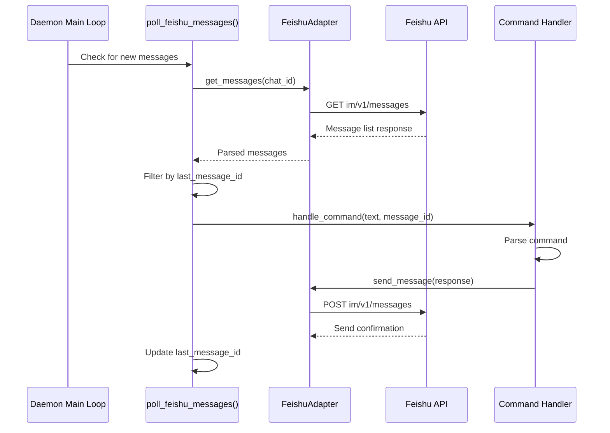
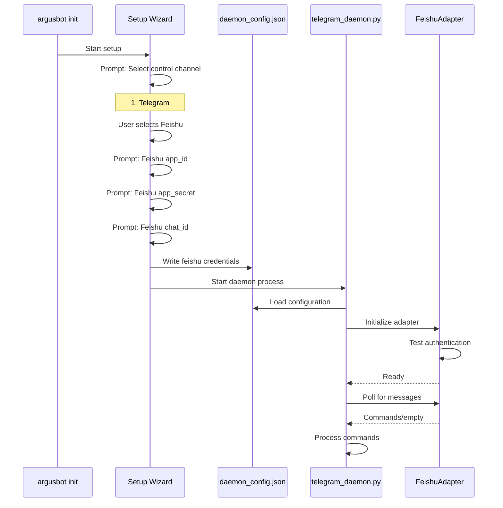

# Feishu Integration
Relevant source files
- [Feishu_readme/Feishu_readme_CN.md](https://github.com/waltstephen/ArgusBot/blob/6d0ec9f8/Feishu_readme/Feishu_readme_CN.md?plain=1)
- [Feishu_readme/first.png](https://github.com/waltstephen/ArgusBot/blob/6d0ec9f8/Feishu_readme/first.png)
- [Feishu_readme/second.png](https://github.com/waltstephen/ArgusBot/blob/6d0ec9f8/Feishu_readme/second.png)
- [Feishu_readme/third.png](https://github.com/waltstephen/ArgusBot/blob/6d0ec9f8/Feishu_readme/third.png)
- [README.md](https://github.com/waltstephen/ArgusBot/blob/6d0ec9f8/README.md?plain=1)

This document describes ArgusBot's integration with Feishu (Lark/飞书) as a control channel. Feishu provides an alternative to Telegram for remote monitoring and control, optimized for CN network environments where Telegram may be unavailable.

For Telegram integration details, see [5.2](/waltstephen/ArgusBot/5.2-telegram-integration). For general command system architecture, see [5.1](/waltstephen/ArgusBot/5.1-command-system-overview). For daemon mode operation, see [3.2](/waltstephen/ArgusBot/3.2-daemon-mode-architecture).

---

## Overview

Feishu integration enables bidirectional communication between ArgusBot and Feishu messaging platform. The daemon can:

- Poll Feishu group chats for control commands
- Send event notifications and live updates to Feishu
- Handle voice-free, text-only command interface
- Operate reliably in CN network environments

Unlike Telegram's Whisper voice transcription, Feishu integration is text-only. The polling model checks for new messages at regular intervals rather than using webhooks.

Sources: [README.md230-276](https://github.com/waltstephen/ArgusBot/blob/6d0ec9f8/README.md?plain=1#L230-L276)

---

## Architecture Overview

### Feishu Integration Components

[Flowchart Diagram]

**Key Characteristics:**

- **Polling Model**: Unlike webhook-based systems, Feishu adapter polls for new messages at regular intervals
- **Token-Based Auth**: Uses tenant access token obtained via app_id and app_secret
- **Chat ID Required**: Messages are sent to and received from a specific chat_id (group chat)
- **Stateless Message Tracking**: Tracks last processed message to avoid duplicates

Sources: [README.md74](https://github.com/waltstephen/ArgusBot/blob/6d0ec9f8/README.md?plain=1#L74-L74)[README.md219-223](https://github.com/waltstephen/ArgusBot/blob/6d0ec9f8/README.md?plain=1#L219-L223)[Feishu_readme/Feishu_readme_CN.md1-173](https://github.com/waltstephen/ArgusBot/blob/6d0ec9f8/Feishu_readme/Feishu_readme_CN.md?plain=1#L1-L173)

---

## Feishu App Setup

### Creating a Feishu Bot Application

To use Feishu integration, you must first create a custom Feishu app in the Feishu Open Platform.

[Flowchart Diagram]

**Required Scopes:**
At least one of the following message-related scopes must be granted:

- `im:message.history:readonly`
- `im:message:readonly`
- `im:message`

**Obtaining chat_id:**

1. Open the target group chat in Feishu
2. Click the three-dot menu in upper right
3. Scroll to bottom to view `chat_id` (format: `oc_xxxxxxxxxxxxxxxxxxxxxxxxxxxxx`)

Sources: [README.md265-270](https://github.com/waltstephen/ArgusBot/blob/6d0ec9f8/README.md?plain=1#L265-L270)[Feishu_readme/Feishu_readme_CN.md31-102](https://github.com/waltstephen/ArgusBot/blob/6d0ec9f8/Feishu_readme/Feishu_readme_CN.md?plain=1#L31-L102)

---

## Configuration Parameters

### Required Parameters

| Parameter | Type | Description | Example |
| --- | --- | --- | --- |
| `feishu_app_id` | string | Feishu application ID from Open Platform | `cli_a1b2c3d4e5f6g7h8` |
| `feishu_app_secret` | string | Feishu application secret (keep secure) | `ABC123xyz...` |
| `feishu_chat_id` | string | Target group chat ID (must start with `oc_`) | `oc_1234567890abcdef` |

### Optional Parameters

| Parameter | Type | Default | Description |
| --- | --- | --- | --- |
| `feishu_receive_id_type` | string | `chat_id` | ID type for message recipients |
| `feishu_events` | string | `""` | Comma-separated events to push to Feishu |
| `feishu_live_updates` | boolean | `false` | Enable live agent message delta updates |
| `feishu_live_interval_seconds` | integer | `30` | Interval for live update pushes |
| `feishu_heartbeat_interval_seconds` | integer | `600` | Typing indicator interval (10 minutes) |
| `feishu_control` | boolean | `false` | Enable inbound command control during runs |

### Configuration in daemon_config.json

```
{
  "control_channel": "feishu",
  "feishu_app_id": "cli_a1b2c3d4e5f6g7h8",
  "feishu_app_secret": "ABC123xyz...",
  "feishu_chat_id": "oc_1234567890abcdef",
  "feishu_receive_id_type": "chat_id",
  "feishu_events": "loop.started,round.review.completed,loop.completed",
  "feishu_live_updates": true,
  "feishu_live_interval_seconds": 30,
  "feishu_heartbeat_interval_seconds": 600,
  "feishu_control": true
}
```

Sources: [README.md236-248](https://github.com/waltstephen/ArgusBot/blob/6d0ec9f8/README.md?plain=1#L236-L248)[Feishu_readme/Feishu_readme_CN.md146-161](https://github.com/waltstephen/ArgusBot/blob/6d0ec9f8/Feishu_readme/Feishu_readme_CN.md?plain=1#L146-L161)

---

## Message Polling Architecture

### Polling Loop Flow



**Message Processing Logic:**

1. Poll at regular intervals (no webhook support in current implementation)
2. Retrieve recent messages from specified chat_id
3. Track `last_message_id` to identify new messages
4. Parse text content for commands (support both `/command` and `@bot /command` formats)
5. Route to command handler
6. Send responses back to same chat

**Command Normalization:**

- Direct commands: `/run`, `/inject`, `/status`, `/stop`
- Mention-prefixed in groups: `@bot /stop` normalized to `/stop`
- Plain text auto-routing: When idle → `/run`, when running → `/inject`

Sources: [README.md250-253](https://github.com/waltstephen/ArgusBot/blob/6d0ec9f8/README.md?plain=1#L250-L253)

---

## Supported Commands

### Feishu Control Commands

| Command | When Available | Description |
| --- | --- | --- |
| `/run <objective>` | Daemon idle | Start a new ArgusBot run with specified objective |
| `/inject <instruction>` | During run | Inject instruction into current round |
| `/status` | Always | Query daemon/child process status |
| `/stop` | During run | Stop active run |
| `/plan <direction>` | During run | Send planning direction to planner agent |
| `/review <criteria>` | During run | Send review criteria to reviewer |
| `/help` | Always | Display command help |
| Plain text | Context-dependent | Auto-routed to `/run` (idle) or `/inject` (running) |

### Command Routing Logic

[Flowchart Diagram]

Sources: [README.md74](https://github.com/waltstephen/ArgusBot/blob/6d0ec9f8/README.md?plain=1#L74-L74)[README.md250-253](https://github.com/waltstephen/ArgusBot/blob/6d0ec9f8/README.md?plain=1#L250-L253)

---

## Message Sending and Notifications

### Event-Driven Notifications

ArgusBot can send notifications to Feishu for specific events during execution.

**Event Types:**

- `loop.started` - New run begins
- `round.started` - Round begins
- `round.main.completed` - Main agent completes
- `round.review.completed` - Reviewer completes
- `loop.completed` - Run finishes
- `loop.stopped` - Run stopped by user

**Configuration Example:**

```
argusbot-run \
  --feishu-app-id "$FEISHU_APP_ID" \
  --feishu-app-secret "$FEISHU_APP_SECRET" \
  --feishu-chat-id "$FEISHU_CHAT_ID" \
  --feishu-events "loop.started,round.review.completed,loop.completed" \
  "your objective"
```

### Live Updates and Heartbeats

[Flowchart Diagram]

**Live Update Features:**

- `--feishu-live-updates`: Enable incremental message delta pushes
- `--feishu-live-interval-seconds 30`: Send deltas every 30 seconds if content changed
- `--feishu-heartbeat-interval-seconds 600`: Send "typing..." indicator every 10 minutes to show run is still active

Sources: [README.md221-222](https://github.com/waltstephen/ArgusBot/blob/6d0ec9f8/README.md?plain=1#L221-L222)

---

## Error Handling

### Common Feishu API Errors

| Error Code | Message | Cause | Solution |
| --- | --- | --- | --- |
| `230006` | Bot ability is not activated | Bot capability not enabled/published | Enable bot capability in Open Platform and publish app |
| `230002` | Bot/User can NOT be out of the chat | Bot not in target group or wrong chat_id | Add bot to target group; verify chat_id is correct |
| `99991672` | Access denied ... scopes required | Required message scopes not granted | Grant `im:message` or related scopes to app |

### Error Handling in Code

The Feishu adapter should implement retry logic and error reporting:

[Flowchart Diagram]

Sources: [README.md273-276](https://github.com/waltstephen/ArgusBot/blob/6d0ec9f8/README.md?plain=1#L273-L276)

---

## Integration with Daemon Mode

### Daemon Initialization with Feishu



### Dual Control Channel Support

While the daemon typically uses one primary control channel, the architecture supports both Telegram and Feishu simultaneously if configured:

[Flowchart Diagram]

**Command Metadata:**
Each command includes source channel metadata to route responses correctly:

- `source_channel`: `"telegram"` | `"feishu"` | `"local"`
- `chat_id` or `message_id`: For response targeting

Sources: [README.md64](https://github.com/waltstephen/ArgusBot/blob/6d0ec9f8/README.md?plain=1#L64-L64)[Feishu_readme/Feishu_readme_CN.md105-142](https://github.com/waltstephen/ArgusBot/blob/6d0ec9f8/Feishu_readme/Feishu_readme_CN.md?plain=1#L105-L142)

---

## Setup Wizard Flow

### Interactive Feishu Configuration

[Flowchart Diagram]

**Setup Example:**

```
$ argusbot init
 
Select control channel:
1. Telegram
2. Feishu (适合CN网络环境)
Choice [1]: 2
 
Enable Feishu bidirectional control? [y/N]: y
Feishu app id: cli_a1b2c3d4e5f6g7h8
Feishu app secret: [hidden]
Feishu chat id: oc_1234567890abcdef
 
Select model preset:
1. quality
2. copilot
3. balanced
4. cheap
Choice [1]: 2
 
Select planner mode:
1. off
2. auto
3. record
Choice [2]: 2
 
✓ Configuration saved to .argusbot/daemon_config.json
✓ Daemon started in background
→ Use 'argusbot' to attach to live output
```

Sources: [README.md454-489](https://github.com/waltstephen/ArgusBot/blob/6d0ec9f8/README.md?plain=1#L454-L489)[Feishu_readme/Feishu_readme_CN.md105-173](https://github.com/waltstephen/ArgusBot/blob/6d0ec9f8/Feishu_readme/Feishu_readme_CN.md?plain=1#L105-L173)

---

## File Attachments and Media

Feishu integration supports sending file attachments for certain commands:

**Supported Attachment Types:**

- Images/photos from BTW agent responses
- Videos from BTW agent responses
- Generic files/documents from BTW agent responses
- Log files and review summaries

**Upload Flow:**
When BTW agent returns attachments:

1. Count total attachments
2. If count > 5, prompt for confirmation via `/confirm-send` or `/cancel-send`
3. Upload each file to Feishu media API
4. Send message with media keys attached

Unlike Telegram's voice message support, Feishu does not currently support voice transcription in this implementation.

Sources: [README.md157](https://github.com/waltstephen/ArgusBot/blob/6d0ec9f8/README.md?plain=1#L157-L157)

---

## Comparison: Feishu vs Telegram

| Feature | Feishu | Telegram |
| --- | --- | --- |
| **Network Availability** | Optimized for CN networks | May be blocked in CN |
| **Authentication** | App ID + Secret + OAuth token | Bot token only |
| **Message Delivery** | Polling-based | Polling-based (getUpdates) |
| **Voice Input** | Not supported | Whisper transcription |
| **File Attachments** | Supported | Supported |
| **Live Updates** | Supported | Supported |
| **Typing Indicator** | Heartbeat messages | sendChatAction API |
| **Setup Complexity** | Requires Open Platform app | Simple bot creation |
| **Token Locking** | Not required (no 409 conflicts) | Required (prevents getUpdates conflicts) |

**When to Choose Feishu:**

- Operating in CN network environment
- Already using Feishu for team communication
- Text-only control is sufficient
- Need reliable connectivity where Telegram is unavailable

**When to Choose Telegram:**

- Need voice command support
- Prefer simpler setup
- Operating outside CN
- Want inline keyboard features

Sources: [README.md34](https://github.com/waltstephen/ArgusBot/blob/6d0ec9f8/README.md?plain=1#L34-L34)[README.md64](https://github.com/waltstephen/ArgusBot/blob/6d0ec9f8/README.md?plain=1#L64-L64)[README.md230-234](https://github.com/waltstephen/ArgusBot/blob/6d0ec9f8/README.md?plain=1#L230-L234)

---

## Minimal Working Example

### Direct CLI Usage

```
# Set environment variables
export FEISHU_APP_ID="cli_a1b2c3d4e5f6g7h8"
export FEISHU_APP_SECRET="your_secret_here"
export FEISHU_CHAT_ID="oc_1234567890abcdef"
 
# Run with Feishu notifications
argusbot-run \
  --feishu-app-id "$FEISHU_APP_ID" \
  --feishu-app-secret "$FEISHU_APP_SECRET" \
  --feishu-chat-id "$FEISHU_CHAT_ID" \
  --feishu-events "loop.started,round.review.completed,loop.completed" \
  --feishu-live-updates \
  --feishu-live-interval-seconds 30 \
  --feishu-heartbeat-interval-seconds 600 \
  --feishu-control \
  "Implement feature X and iterate until tests pass"
```

### Daemon Mode with Feishu

```
# Interactive setup
argusbot init
# Select: 2. Feishu
# Enter credentials when prompted
 
# Daemon auto-starts, then attach monitor
argusbot
 
# From Feishu group chat:
# Send: /run Implement feature X and iterate until tests pass
# Send: /status
# Send: /inject Fix test failures first
# Send: /stop
```

Sources: [README.md256-263](https://github.com/waltstephen/ArgusBot/blob/6d0ec9f8/README.md?plain=1#L256-L263)

---

## Configuration Reference

### Full Parameter List for daemon_config.json

```
{
  "control_channel": "feishu",
  
  "_comment_required": "Required Feishu parameters",
  "feishu_app_id": "cli_xxxxx",
  "feishu_app_secret": "secret_xxxxx",
  "feishu_chat_id": "oc_xxxxx",
  
  "_comment_optional": "Optional Feishu parameters",
  "feishu_receive_id_type": "chat_id",
  "feishu_events": "loop.started,round.review.completed,loop.completed",
  "feishu_live_updates": true,
  "feishu_live_interval_seconds": 30,
  "feishu_heartbeat_interval_seconds": 600,
  "feishu_control": true,
  
  "_comment_shared": "Shared daemon parameters",
  "run_check": "pytest -q",
  "model_preset": "copilot",
  "planner_mode": "auto",
  "yolo": true,
  "max_rounds": 500
}
```

### CLI Arguments Reference

All Feishu parameters can be passed via command line instead of config file:

```
--feishu-app-id TEXT              Feishu application ID
--feishu-app-secret TEXT          Feishu application secret  
--feishu-chat-id TEXT             Feishu chat/group ID (oc_xxx format)
--feishu-receive-id-type TEXT     ID type for recipients [default: chat_id]
--feishu-events TEXT              Comma-separated event types to push
--feishu-live-updates             Enable live message delta updates
--feishu-live-interval-seconds N  Live update push interval [default: 30]
--feishu-heartbeat-interval-seconds N  Heartbeat interval [default: 600]
--feishu-control                  Enable inbound command control
```

Sources: [README.md219-223](https://github.com/waltstephen/ArgusBot/blob/6d0ec9f8/README.md?plain=1#L219-L223)[README.md242-248](https://github.com/waltstephen/ArgusBot/blob/6d0ec9f8/README.md?plain=1#L242-L248)