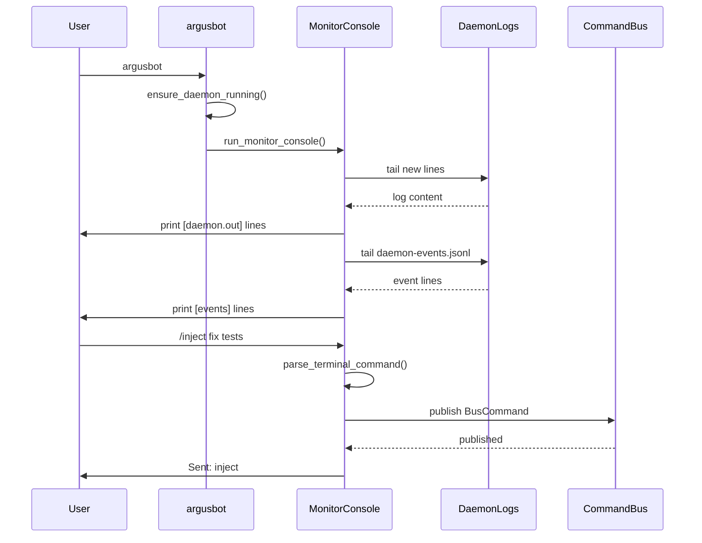
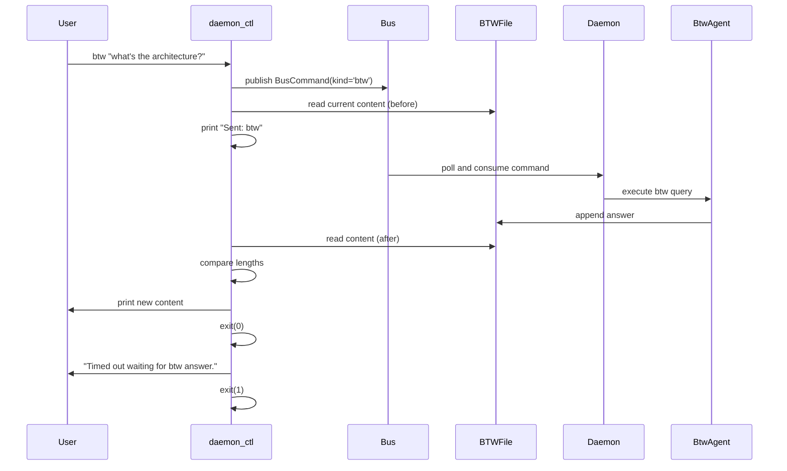
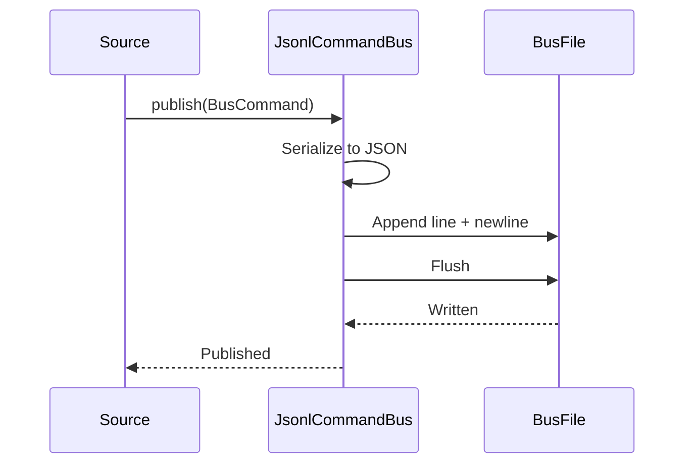

# Local Control
Relevant source files
- [QUICKSTART.md](https://github.com/waltstephen/ArgusBot/blob/6d0ec9f8/QUICKSTART.md?plain=1)
- [codex_autoloop/codexloop.py](https://github.com/waltstephen/ArgusBot/blob/6d0ec9f8/codex_autoloop/codexloop.py)
- [codex_autoloop/daemon_ctl.py](https://github.com/waltstephen/ArgusBot/blob/6d0ec9f8/codex_autoloop/daemon_ctl.py)
- [codex_autoloop/telegram_control.py](https://github.com/waltstephen/ArgusBot/blob/6d0ec9f8/codex_autoloop/telegram_control.py)
- [tests/test_codexloop.py](https://github.com/waltstephen/ArgusBot/blob/6d0ec9f8/tests/test_codexloop.py)
- [tests/test_telegram_control.py](https://github.com/waltstephen/ArgusBot/blob/6d0ec9f8/tests/test_telegram_control.py)

This page documents local control mechanisms for ArgusBot: the `argusbot` terminal command, the `argusbot-daemon-ctl` utility, and the JSONL bus communication system that enables daemon-to-child process communication. For control via messaging platforms, see [Telegram Integration](/waltstephen/ArgusBot/5.2-telegram-integration) and [Feishu Integration](/waltstephen/ArgusBot/5.3-feishu-integration).

---

## Terminal Control via `argusbot`

The `argusbot` command serves as the primary local entrypoint for interacting with the ArgusBot daemon. It provides both CLI subcommands for one-shot operations and an interactive monitor console for real-time control.

### Command-Line Interface

The `argusbot` binary supports multiple subcommands for daemon management and control:

| Subcommand | Purpose | Example |
| --- | --- | --- |
| `help` | Display supported features and commands | `argusbot help` |
| `init` | Stop current daemon, reconfigure, restart | `argusbot init` |
| `status` | Display daemon status as JSON | `argusbot status` |
| `run <objective>` | Start a new run with objective text | `argusbot run "implement feature X"` |
| `new` | Force next run to use fresh session | `argusbot new` |
| `inject <text>` | Inject instruction into active run | `argusbot inject "fix tests first"` |
| `mode <value>` | Hot-switch planner mode | `argusbot mode auto` |
| `btw <question>` | Ask BTW side-agent a question | `argusbot btw "what's the architecture?"` |
| `plan <direction>` | Send direction to plan agent | `argusbot plan "focus on testing"` |
| `review <criteria>` | Send audit criteria to reviewer | `argusbot review "must pass pytest"` |
| `show-main-prompt` | Print latest main prompt markdown | `argusbot show-main-prompt` |
| `show-plan` | Print latest plan markdown | `argusbot show-plan` |
| `show-plan-context` | Print plan directions and inputs | `argusbot show-plan-context` |
| `show-review [round]` | Print review summary markdown | `argusbot show-review 3` |
| `show-review-context` | Print review direction and criteria | `argusbot show-review-context` |
| `stop` | Stop active run | `argusbot stop` |
| `daemon-stop` | Stop daemon process | `argusbot daemon-stop` |

**Sources:**[codex_autoloop/codexloop.py184-245](https://github.com/waltstephen/ArgusBot/blob/6d0ec9f8/codex_autoloop/codexloop.py#L184-L245)[codex_autoloop/codexloop.py248-301](https://github.com/waltstephen/ArgusBot/blob/6d0ec9f8/codex_autoloop/codexloop.py#L248-L301)

### Argument Parsing

The CLI argument parser is constructed in `build_parser()`, which creates an `ArgumentParser` with subcommands for each control operation:

[Flowchart Diagram]

**Sources:**[codex_autoloop/codexloop.py184-245](https://github.com/waltstephen/ArgusBot/blob/6d0ec9f8/codex_autoloop/codexloop.py#L184-L245)[tests/test_codexloop.py41-73](https://github.com/waltstephen/ArgusBot/blob/6d0ec9f8/tests/test_codexloop.py#L41-L73)

### Interactive Monitor Console

When invoked without a subcommand, `argusbot` enters monitor mode, which attaches to the running daemon and provides an interactive console with real-time log tailing and command input:



The monitor console tracks file offsets to display only new content from:

- `.argusbot/daemon.out` - daemon stdout/stderr
- `.argusbot/logs/daemon-events.jsonl` - structured event log

**Sources:**[codex_autoloop/codexloop.py814-920](https://github.com/waltstephen/ArgusBot/blob/6d0ec9f8/codex_autoloop/codexloop.py#L814-L920)

### Terminal Command Parsing

The monitor console accepts both slash commands and plain text. Plain text routing depends on daemon state:

[Flowchart Diagram]

The parsing logic is implemented in `parse_terminal_command()`:

| Input Pattern | Running State | Resulting Command |
| --- | --- | --- |
| `/run <text>` | Any | `run` with text |
| `/inject <text>` | Any | `inject` with text |
| `/stop` | Any | `stop` |
| `/status` | Any | `status` |
| `/new` | Any | `fresh-session` |
| `/mode <value>` | Any | `mode` with value |
| `/mode` (no value) | Any | `mode-menu` |
| Plain text | Running | `inject` with text |
| Plain text | Idle | `run` with text |

**Sources:**[codex_autoloop/codexloop.py922-981](https://github.com/waltstephen/ArgusBot/blob/6d0ec9f8/codex_autoloop/codexloop.py#L922-L981)[tests/test_codexloop.py7-39](https://github.com/waltstephen/ArgusBot/blob/6d0ec9f8/tests/test_codexloop.py#L7-L39)

---

## Daemon Control Utility (`argusbot-daemon-ctl`)

The `argusbot-daemon-ctl` command provides programmatic access to daemon control without entering the interactive monitor. This utility is useful for scripting and automation.

### Command Structure

[Flowchart Diagram]

**Sources:**[codex_autoloop/daemon_ctl.py213-247](https://github.com/waltstephen/ArgusBot/blob/6d0ec9f8/codex_autoloop/daemon_ctl.py#L213-L247)

### Main Control Flow

The `daemon_ctl` module processes commands by either publishing to the bus or reading status artifacts:

[Flowchart Diagram]

**Sources:**[codex_autoloop/daemon_ctl.py18-164](https://github.com/waltstephen/ArgusBot/blob/6d0ec9f8/codex_autoloop/daemon_ctl.py#L18-L164)

### Status Inspection

The `status` subcommand reads `daemon_status.json` and enriches it with liveness information:

```
# Status inspection adds fields:
payload["daemon_status_live"] = inspection.is_live
payload["daemon_status_state"] = "live" | "stale" | "offline"
payload["daemon_status_warning"] = inspection.reason  # if any
```

Status is considered "stale" if the file hasn't been updated within `DEFAULT_DAEMON_STATUS_STALE_SECONDS` (default 10 seconds).

**Sources:**[codex_autoloop/daemon_ctl.py170-192](https://github.com/waltstephen/ArgusBot/blob/6d0ec9f8/codex_autoloop/daemon_ctl.py#L170-L192)

### BTW Command Polling

The `btw` subcommand uses a unique polling mechanism to wait for agent response:



**Sources:**[codex_autoloop/daemon_ctl.py99-125](https://github.com/waltstephen/ArgusBot/blob/6d0ec9f8/codex_autoloop/daemon_ctl.py#L99-L125)

---

## JSONL Bus Communication

The JSONL bus system enables asynchronous communication between the daemon and child processes, as well as between terminal/Telegram/Feishu sources and the daemon.

### Bus Architecture

[Flowchart Diagram]

**Sources:**[codex_autoloop/codexloop.py808-812](https://github.com/waltstephen/ArgusBot/blob/6d0ec9f8/codex_autoloop/codexloop.py#L808-L812)[README.md492-499](https://github.com/waltstephen/ArgusBot/blob/6d0ec9f8/README.md?plain=1#L492-L499)

### BusCommand Structure

Commands are represented by the `BusCommand` dataclass:

```
@dataclass
class BusCommand:
    kind: str        # Command type (run, inject, stop, etc.)
    text: str        # Command payload text
    source: str      # Origin (terminal, telegram, feishu)
    ts: float        # Unix timestamp
```

The `JsonlCommandBus` class handles reading and writing commands to JSONL files with line-based locking for concurrent access.

**Sources:**[codex_autoloop/daemon_bus.py15-30](https://github.com/waltstephen/ArgusBot/blob/6d0ec9f8/codex_autoloop/daemon_bus.py#L15-L30)

### Bus File Locations

The bus directory structure is defined by `daemon_config.json`:

| File | Purpose | Readers | Writers |
| --- | --- | --- | --- |
| `daemon_commands.jsonl` | Daemon-level commands | Daemon | Terminal, Telegram, Feishu |
| `child_control.jsonl` | Child-process commands | Child loop | Daemon (forwards) |
| `daemon_status.json` | Daemon status snapshot | Terminal, daemon-ctl | Daemon |

The default bus directory is `.argusbot/bus/`, configurable via `--bus-dir` or `daemon_config.json`.

**Sources:**[codex_autoloop/codexloop.py536-543](https://github.com/waltstephen/ArgusBot/blob/6d0ec9f8/codex_autoloop/codexloop.py#L536-L543)

### Command Publishing

Publishing to the bus is atomic per-line:



The implementation ensures each command is a single line, enabling race-free consumption by multiple readers.

**Sources:**[codex_autoloop/daemon_bus.py40-60](https://github.com/waltstephen/ArgusBot/blob/6d0ec9f8/codex_autoloop/daemon_bus.py#L40-L60)

### Command Routing Flow

The daemon acts as a router, determining whether to handle a command locally or forward it to the active child:

[Flowchart Diagram]

**Sources:**[README.md492-499](https://github.com/waltstephen/ArgusBot/blob/6d0ec9f8/README.md?plain=1#L492-L499) High-level Diagram 2

---

## Command Parsing and Normalization

### Slash Command Parsing

Both terminal and Telegram/Feishu inputs use similar command parsing logic. The terminal parser recognizes these patterns:

| Pattern | Command Type | Example |
| --- | --- | --- |
| `/run <text>` | `run` | `/run implement tests` |
| `/inject <text>` | `inject` | `/inject fix error first` |
| `/stop` | `stop` | `/stop` |
| `/status` | `status` | `/status` |
| `/new` | `fresh-session` | `/new` |
| `/mode <value>` | `mode` | `/mode auto` |
| `/mode` (no args) | `mode-menu` | `/mode` |
| `/btw <text>` | `btw` | `/btw what's this file?` |
| `/plan <text>` | `plan` | `/plan focus on docs` |
| `/review <text>` | `review` | `/review check coverage` |
| `/daemon-stop` | `daemon-stop` | `/daemon-stop` |
| `/help` | `help` | `/help` |

Commands with empty payloads (e.g., `/run` without text) return `None` and are ignored.

**Sources:**[codex_autoloop/codexloop.py922-981](https://github.com/waltstephen/ArgusBot/blob/6d0ec9f8/codex_autoloop/codexloop.py#L922-L981)

### CJK Punctuation Normalization

The Telegram parser includes normalization for CJK (Chinese/Japanese/Korean) punctuation marks that might be accidentally used instead of ASCII slash:

```
def normalize_command_prefix(text: str) -> str:
    if text.startswith("／"):  # Full-width slash
        return "/" + text[1:].lstrip()
    if text.startswith("、"):  # Ideographic comma
        return "/" + text[1:].lstrip()
    return text
```

This allows inputs like `／status` or `、help` to be recognized as commands.

**Sources:**[codex_autoloop/telegram_control.py490-497](https://github.com/waltstephen/ArgusBot/blob/6d0ec9f8/codex_autoloop/telegram_control.py#L490-L497)[tests/test_telegram_control.py193-206](https://github.com/waltstephen/ArgusBot/blob/6d0ec9f8/tests/test_telegram_control.py#L193-L206)

### Plain Text Routing

When input is not a recognized slash command, the routing behavior depends on daemon state:

[Flowchart Diagram]

This allows users to type natural language without the `/run` or `/inject` prefix. The appropriate command type is inferred from context.

**Sources:**[codex_autoloop/codexloop.py922-981](https://github.com/waltstephen/ArgusBot/blob/6d0ec9f8/codex_autoloop/codexloop.py#L922-L981)[tests/test_codexloop.py7-19](https://github.com/waltstephen/ArgusBot/blob/6d0ec9f8/tests/test_codexloop.py#L7-L19)

---

## Command-to-Code Mapping

This section maps command types to their code execution paths:

### Terminal Commands → Code Execution

| Command | Entry Point | Handler | Bus Kind | Terminal Code Path |
| --- | --- | --- | --- | --- |
| `argusbot run` | [codexloop.py65](https://github.com/waltstephen/ArgusBot/blob/6d0ec9f8/codexloop.py#L65-L65) | [codexloop.py173-181](https://github.com/waltstephen/ArgusBot/blob/6d0ec9f8/codexloop.py#L173-L181) | `run` | publish_command() → daemon_commands.jsonl |
| `argusbot inject` | [codexloop.py65](https://github.com/waltstephen/ArgusBot/blob/6d0ec9f8/codexloop.py#L65-L65) | [codexloop.py173-181](https://github.com/waltstephen/ArgusBot/blob/6d0ec9f8/codexloop.py#L173-L181) | `inject` | publish_command() → daemon_commands.jsonl |
| `argusbot stop` | [codexloop.py65](https://github.com/waltstephen/ArgusBot/blob/6d0ec9f8/codexloop.py#L65-L65) | [codexloop.py173-181](https://github.com/waltstephen/ArgusBot/blob/6d0ec9f8/codexloop.py#L173-L181) | `stop` | publish_command() → daemon_commands.jsonl |
| `argusbot status` | [codexloop.py65](https://github.com/waltstephen/ArgusBot/blob/6d0ec9f8/codexloop.py#L65-L65) | [codexloop.py115-121](https://github.com/waltstephen/ArgusBot/blob/6d0ec9f8/codexloop.py#L115-L121) | N/A | read_status() → print JSON |
| `argusbot new` | [codexloop.py65](https://github.com/waltstephen/ArgusBot/blob/6d0ec9f8/codexloop.py#L65-L65) | [codexloop.py173-181](https://github.com/waltstephen/ArgusBot/blob/6d0ec9f8/codexloop.py#L173-L181) | `fresh-session` | publish_command() → daemon_commands.jsonl |
| `argusbot mode` | [codexloop.py65](https://github.com/waltstephen/ArgusBot/blob/6d0ec9f8/codexloop.py#L65-L65) | [codexloop.py173-181](https://github.com/waltstephen/ArgusBot/blob/6d0ec9f8/codexloop.py#L173-L181) | `mode` or `mode-menu` | publish_command() → daemon_commands.jsonl |
| `argusbot daemon-stop` | [codexloop.py65](https://github.com/waltstephen/ArgusBot/blob/6d0ec9f8/codexloop.py#L65-L65) | [codexloop.py173-181](https://github.com/waltstephen/ArgusBot/blob/6d0ec9f8/codexloop.py#L173-L181) | `daemon-stop` | publish_command() → daemon_commands.jsonl |

**Sources:**[codex_autoloop/codexloop.py65-182](https://github.com/waltstephen/ArgusBot/blob/6d0ec9f8/codex_autoloop/codexloop.py#L65-L182)

### daemon-ctl Commands → Code Execution

| Command | Entry Point | Handler | Action |
| --- | --- | --- | --- |
| `daemon-ctl status` | [daemon_ctl.py18](https://github.com/waltstephen/ArgusBot/blob/6d0ec9f8/daemon_ctl.py#L18-L18) | [daemon_ctl.py26-29](https://github.com/waltstephen/ArgusBot/blob/6d0ec9f8/daemon_ctl.py#L26-L29) | load_status_for_cli() → print JSON |
| `daemon-ctl run` | [daemon_ctl.py18](https://github.com/waltstephen/ArgusBot/blob/6d0ec9f8/daemon_ctl.py#L18-L18) | [daemon_ctl.py89-92](https://github.com/waltstephen/ArgusBot/blob/6d0ec9f8/daemon_ctl.py#L89-L92) | publish(bus, "run", text) |
| `daemon-ctl inject` | [daemon_ctl.py18](https://github.com/waltstephen/ArgusBot/blob/6d0ec9f8/daemon_ctl.py#L18-L18) | [daemon_ctl.py127-130](https://github.com/waltstephen/ArgusBot/blob/6d0ec9f8/daemon_ctl.py#L127-L130) | publish(bus, "inject", text) |
| `daemon-ctl btw` | [daemon_ctl.py18](https://github.com/waltstephen/ArgusBot/blob/6d0ec9f8/daemon_ctl.py#L18-L18) | [daemon_ctl.py99-125](https://github.com/waltstephen/ArgusBot/blob/6d0ec9f8/daemon_ctl.py#L99-L125) | publish + poll btw_messages_file |
| `daemon-ctl show-plan` | [daemon_ctl.py18](https://github.com/waltstephen/ArgusBot/blob/6d0ec9f8/daemon_ctl.py#L18-L18) | [daemon_ctl.py31-35](https://github.com/waltstephen/ArgusBot/blob/6d0ec9f8/daemon_ctl.py#L31-L35) | read child_plan_report_path |
| `daemon-ctl show-review` | [daemon_ctl.py18](https://github.com/waltstephen/ArgusBot/blob/6d0ec9f8/daemon_ctl.py#L18-L18) | [daemon_ctl.py54-70](https://github.com/waltstephen/ArgusBot/blob/6d0ec9f8/daemon_ctl.py#L54-L70) | read review_summaries_dir |

**Sources:**[codex_autoloop/daemon_ctl.py18-164](https://github.com/waltstephen/ArgusBot/blob/6d0ec9f8/codex_autoloop/daemon_ctl.py#L18-L164)

### Monitor Console Commands → Execution

The interactive monitor console parses input via `parse_terminal_command()` and routes to the same `publish_command()` function:

[Flowchart Diagram]

**Sources:**[codex_autoloop/codexloop.py860-920](https://github.com/waltstephen/ArgusBot/blob/6d0ec9f8/codex_autoloop/codexloop.py#L860-L920)