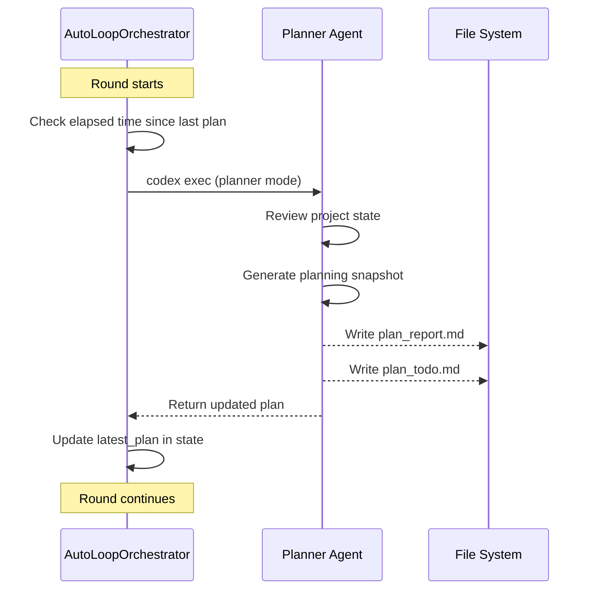

# Planner Sub-Agent
Relevant source files
- [README.md](https://github.com/waltstephen/ArgusBot/blob/6d0ec9f8/README.md?plain=1)
- [codex_autoloop/telegram_daemon.py](https://github.com/waltstephen/ArgusBot/blob/6d0ec9f8/codex_autoloop/telegram_daemon.py)
- [tests/test_telegram_daemon.py](https://github.com/waltstephen/ArgusBot/blob/6d0ec9f8/tests/test_telegram_daemon.py)

## Purpose and Scope

The Planner Sub-Agent maintains a high-level view of project progress and proposes concrete next-step objectives when runs complete. It operates independently from the main execution loop, running background updates at regular intervals to keep track of what has been done and what remains. When enabled in `auto` mode, the planner can propose and automatically execute follow-up objectives, creating a continuous workflow until the overall project goal is achieved.

This page covers the planner's operation modes, background update mechanism, follow-up proposal logic, and output artifacts. For the main execution loop orchestration, see [AutoLoopOrchestrator](/waltstephen/ArgusBot/4.1-autolooporchestrator). For the reviewer sub-agent that gates completion decisions, see [Reviewer Sub-Agent](/waltstephen/ArgusBot/4.2-reviewer-sub-agent).

---

## Planner Modes

The planner supports three distinct operational modes that control its behavior and level of automation:

### Mode Definitions

| Mode | Constant | Behavior |
| --- | --- | --- |
| `off` | `PLANNER_MODE_OFF` | Planner is completely disabled; no background updates or follow-up proposals |
| `auto` | `PLANNER_MODE_AUTO` | Planner runs background updates and daemon may auto-execute proposed follow-ups |
| `record` | `PLANNER_MODE_RECORD` | Planner runs background updates and writes session summaries to a table, but does not propose follow-ups |

**Mode Selection Priority:**

[Flowchart Diagram]

**Sources:**[codex_autoloop/planner_modes.py](https://github.com/waltstephen/ArgusBot/blob/6d0ec9f8/codex_autoloop/planner_modes.py)[codex_autoloop/telegram_daemon.py29-34](https://github.com/waltstephen/ArgusBot/blob/6d0ec9f8/codex_autoloop/telegram_daemon.py#L29-L34)

---

## Background Update Mechanism

When planner mode is not `off`, the planner runs periodic background updates during the main execution loop. These updates generate markdown snapshots of project state.

### Update Timing

The planner update interval is controlled by `--plan-update-interval-seconds` (default: 1800 seconds = 30 minutes).



**Sources:**[README.md212](https://github.com/waltstephen/ArgusBot/blob/6d0ec9f8/README.md?plain=1#L212-L212)[codex_autoloop/telegram_daemon.py1363](https://github.com/waltstephen/ArgusBot/blob/6d0ec9f8/codex_autoloop/telegram_daemon.py#L1363-L1363)

### Output Files

The planner produces two primary markdown files during background updates:

| File | Purpose | Consumer |
| --- | --- | --- |
| `plan_report.md` | Full planning snapshot with overview, workstreams, and suggested next objective | Daemon follow-up logic, operator review |
| `plan_todo.md` | Mirror of plan_report.md for TODO board visibility | Operator monitoring |
| `plan-agent-records.md` | Historical table of all run summaries (record mode only) | Audit trail, continuity tracking |

**Sources:**[README.md70](https://github.com/waltstephen/ArgusBot/blob/6d0ec9f8/README.md?plain=1#L70-L70)[codex_autoloop/telegram_daemon.py458-460](https://github.com/waltstephen/ArgusBot/blob/6d0ec9f8/codex_autoloop/telegram_daemon.py#L458-L460)

---

## Follow-Up Proposal Flow

When a run completes and planner mode is `auto`, the daemon evaluates whether to propose a follow-up objective and potentially auto-execute it.

### Decision Logic

[Flowchart Diagram]

**Sources:**[codex_autoloop/telegram_daemon.py893-973](https://github.com/waltstephen/ArgusBot/blob/6d0ec9f8/codex_autoloop/telegram_daemon.py#L893-L973)[codex_autoloop/telegram_daemon.py1627-1636](https://github.com/waltstephen/ArgusBot/blob/6d0ec9f8/codex_autoloop/telegram_daemon.py#L1627-L1636)

### Follow-Up Request Generation

The `build_plan_request` function constructs the next objective using this priority order:

1. **Planner main instruction** (if `latest_plan.follow_up_required != false`)
2. **Planner report suggested objective** (extracted from `## Suggested Next Objective` section)
3. **Reviewer next_action** (if actionable and not a terminal handoff)
4. **Fallback continuation** (generic continuation with context from original objective)

[Flowchart Diagram]

**Sources:**[codex_autoloop/telegram_daemon.py1681-1719](https://github.com/waltstephen/ArgusBot/blob/6d0ec9f8/codex_autoloop/telegram_daemon.py#L1681-L1719)

---

## State Persistence

The planner stores its state in multiple locations for cross-run continuity and operator visibility.

### State File Schema

The `state_file` (typically `.argusbot/last_state.json`) includes planner-related fields:

```
{
  "session_id": "thread-xxx",
  "latest_plan": {
    "follow_up_required": true,
    "main_instruction": "Next concrete objective text"
  },
  "latest_review_status": "done",
  "rounds": [...]
}
```

**Key Fields:**

| Field Path | Type | Purpose |
| --- | --- | --- |
| `latest_plan.follow_up_required` | `bool \| null` | Indicates if planner recommends continuing |
| `latest_plan.main_instruction` | `str` | Planner's proposed next objective |
| `latest_review_status` | `str` | Quick-access copy of last review status |

**Sources:**[codex_autoloop/telegram_daemon.py1792-1807](https://github.com/waltstephen/ArgusBot/blob/6d0ec9f8/codex_autoloop/telegram_daemon.py#L1792-L1807)

### Plan Report Structure

The `plan_report.md` file follows a standardized markdown template:

```
# Planning Snapshot
 
[Overview of project state]
 
## Suggested Next Objective
 
[Concrete next step or "No follow-up objective proposed yet."]
 
## Workstreams
 
[Active work areas and their status]
 
## Acceptance Checks
 
[Validation criteria]
```

The daemon extracts the suggested objective by splitting on `## Suggested Next Objective` and reading until the next `## ` header.

**Sources:**[codex_autoloop/telegram_daemon.py1820-1840](https://github.com/waltstephen/ArgusBot/blob/6d0ec9f8/codex_autoloop/telegram_daemon.py#L1820-L1840)

---

## Daemon Integration

The daemon manages planner behavior through scheduled timers and follow-up execution logic.

### Timer Management

[State Diagram]

**Daemon State Variables:**

| Variable | Type | Purpose |
| --- | --- | --- |
| `scheduled_plan_context` | `dict` | Stores objective, exit_code, state_payload for delayed request generation |
| `scheduled_plan_request_at` | `datetime` | When to generate the plan request |
| `pending_plan_request` | `str` | Generated request objective text |
| `pending_plan_auto_execute_at` | `datetime` | When to auto-execute if not overridden |

**Sources:**[codex_autoloop/telegram_daemon.py311-316](https://github.com/waltstephen/ArgusBot/blob/6d0ec9f8/codex_autoloop/telegram_daemon.py#L311-L316)[codex_autoloop/telegram_daemon.py975-1037](https://github.com/waltstephen/ArgusBot/blob/6d0ec9f8/codex_autoloop/telegram_daemon.py#L975-L1037)

### Follow-Up User Interaction

When a follow-up is ready, the daemon sends a Telegram prompt with inline buttons:

1. **Execute Next Step** - Immediately launch the proposed objective
2. **Reject Plan** - Cancel auto-execution and wait for manual `/run`
3. **Modify Then Execute** - Prompt for user edits, then append to base objective

If no action is taken, the daemon auto-executes after `follow_up_auto_execute_seconds` (default: 600 seconds = 10 minutes).

**Sources:**[codex_autoloop/telegram_daemon.py539-579](https://github.com/waltstephen/ArgusBot/blob/6d0ec9f8/codex_autoloop/telegram_daemon.py#L539-L579)

---

## Configuration and Control

### CLI Arguments

| Argument | Default | Description |
| --- | --- | --- |
| `--planner` / `--no-planner` | `--no-planner` | Enable/disable planner entirely |
| `--planner-mode` | `auto` | Set mode: `off`, `auto`, or `record` |
| `--planner-model` | (reviewer model) | Override planner agent model |
| `--planner-reasoning-effort` | (reviewer effort) | Override reasoning effort level |
| `--plan-update-interval-seconds` | `1800` | Background update frequency |
| `--plan-report-file` | - | Path to write plan_report.md |
| `--plan-todo-file` | - | Path to write plan_todo.md |
| `--plan-record-file` | `.argusbot/logs/plan-agent-records.md` | Path for record mode table |

**Sources:**[README.md204-213](https://github.com/waltstephen/ArgusBot/blob/6d0ec9f8/README.md?plain=1#L204-L213)[codex_autoloop/telegram_daemon.py2050-2065](https://github.com/waltstephen/ArgusBot/blob/6d0ec9f8/codex_autoloop/telegram_daemon.py#L2050-L2065)

### Runtime Mode Switching

In daemon mode, operators can hot-switch planner modes via `/mode` command:

```
# Terminal control
argusbot-daemon-ctl --bus-dir .argusbot/bus mode auto
argusbot-daemon-ctl --bus-dir .argusbot/bus mode record
argusbot-daemon-ctl --bus-dir .argusbot/bus mode off
 
# Telegram control
/mode auto
/mode record
/mode off
```

The mode change applies to:

1. Future runs launched by daemon
2. Active run (forwarded via control bus)

**Sources:**[codex_autoloop/telegram_daemon.py721-740](https://github.com/waltstephen/ArgusBot/blob/6d0ec9f8/codex_autoloop/telegram_daemon.py#L721-L740)[README.md149-172](https://github.com/waltstephen/ArgusBot/blob/6d0ec9f8/README.md?plain=1#L149-L172)

---

## Record Mode Table

When `planner-mode=record`, the daemon appends a markdown table row after each run instead of proposing follow-ups:

| finished_at | objective | exit_code | review_status | review_next_action | session_id | log |
| --- | --- | --- | --- | --- | --- | --- |
| 2026-01-15T10:30:00Z | Implement feature X | 0 | done | - | thread-abc123 | .argusbot/logs/run-20260115-103000.log |
| 2026-01-15T11:45:00Z | Add tests for feature X | 2 | continue | Fix test failures | thread-def456 | .argusbot/logs/run-20260115-114500.log |

This provides an audit trail without automated follow-up execution.

**Sources:**[codex_autoloop/telegram_daemon.py1868-1900](https://github.com/waltstephen/ArgusBot/blob/6d0ec9f8/codex_autoloop/telegram_daemon.py#L1868-L1900)

---

## Sanitization and Safety

### Objective Sanitization

The `sanitize_follow_up_objective` function removes:

- `/run` command prefixes (from markdown copy-paste)
- `run /run` double prefixes
- Objective context suffixes like `（目标上下文：...）`

This ensures clean objectives when the planner's output gets recycled as the next run's input.

**Sources:**[codex_autoloop/telegram_daemon.py1722-1764](https://github.com/waltstephen/ArgusBot/blob/6d0ec9f8/codex_autoloop/telegram_daemon.py#L1722-L1764)

### Terminal Handoff Detection

The system detects when the reviewer's `next_action` is a terminal handoff instruction rather than an actionable objective:

- "wait for the user's next instruction"
- "stop the autoloop"
- "等待用户下一步指令"

These phrases prevent the planner from treating handoff messages as concrete objectives.

**Sources:**[codex_autoloop/telegram_daemon.py1767-1783](https://github.com/waltstephen/ArgusBot/blob/6d0ec9f8/codex_autoloop/telegram_daemon.py#L1767-L1783)

---

## Git Checkpointing

Before auto-executing a follow-up objective, the daemon attempts to create a git checkpoint commit if the workspace is dirty. This ensures state is captured before proceeding.

[Flowchart Diagram]

**Sources:**[codex_autoloop/telegram_daemon.py577-606](https://github.com/waltstephen/ArgusBot/blob/6d0ec9f8/codex_autoloop/telegram_daemon.py#L577-L606)[README.md443](https://github.com/waltstephen/ArgusBot/blob/6d0ec9f8/README.md?plain=1#L443-L443)

---

## Integration with Orchestrator

The orchestrator calls the planner agent as a separate Codex session during background updates. The planner receives:

- Current project file tree
- Recent round summaries
- Operator messages history
- Previous plan report (for continuity)

The orchestrator writes the planner's output to `state_file.latest_plan` for daemon consumption.

**Sources:**[README.md12-13](https://github.com/waltstephen/ArgusBot/blob/6d0ec9f8/README.md?plain=1#L12-L13) High-level architecture diagrams