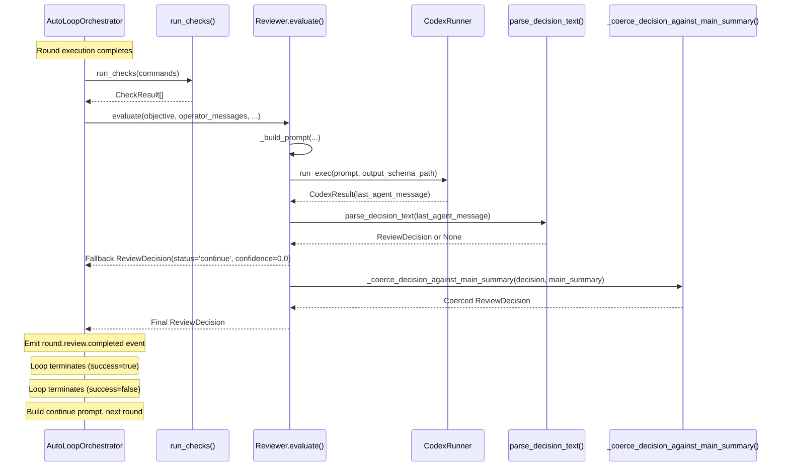

# Reviewer Sub-Agent
Relevant source files
- [README.md](https://github.com/waltstephen/ArgusBot/blob/6d0ec9f8/README.md?plain=1)
- [codex_autoloop/orchestrator.py](https://github.com/waltstephen/ArgusBot/blob/6d0ec9f8/codex_autoloop/orchestrator.py)
- [codex_autoloop/reviewer.py](https://github.com/waltstephen/ArgusBot/blob/6d0ec9f8/codex_autoloop/reviewer.py)
- [tests/test_reviewer.py](https://github.com/waltstephen/ArgusBot/blob/6d0ec9f8/tests/test_reviewer.py)

The Reviewer Sub-Agent is a specialized AI agent that gates completion of each execution round in ArgusBot's auto-loop. It evaluates whether the Main Agent has fully satisfied the objective by analyzing execution results, acceptance check outcomes, and operator messages. The reviewer outputs structured JSON decisions that determine whether the loop should terminate (`done`), continue to the next round (`continue`), or stop due to blocking issues (`blocked`). For information about the overall auto-loop execution flow, see [AutoLoopOrchestrator](/waltstephen/ArgusBot/4.1-autolooporchestrator). For planner-provided guidance during reviews, see [Planner Sub-Agent](/waltstephen/ArgusBot/4.3-planner-sub-agent).

**Sources:**[README.md11-14](https://github.com/waltstephen/ArgusBot/blob/6d0ec9f8/README.md?plain=1#L11-L14)[codex_autoloop/reviewer.py1-27](https://github.com/waltstephen/ArgusBot/blob/6d0ec9f8/codex_autoloop/reviewer.py#L1-L27)

---

## Role in the Execution Loop

The reviewer acts as a gating mechanism between rounds. After the Main Agent completes its execution and acceptance checks run, the reviewer receives all available context and must decide whether the objective is satisfied. The loop only terminates successfully when the reviewer returns `done` status **and** all acceptance checks pass.

**Diagram: Reviewer Position in Round Execution**

[Flowchart Diagram]

**Sources:**[codex_autoloop/orchestrator.py257-336](https://github.com/waltstephen/ArgusBot/blob/6d0ec9f8/codex_autoloop/orchestrator.py#L257-L336)[codex_autoloop/reviewer.py23-83](https://github.com/waltstephen/ArgusBot/blob/6d0ec9f8/codex_autoloop/reviewer.py#L23-L83)

---

## ReviewDecision Schema

The reviewer produces structured output conforming to a JSON schema. The `ReviewDecision` data class contains five required fields and two markdown fields for documentation.

| Field | Type | Description |
| --- | --- | --- |
| `status` | `str` | Must be `"done"`, `"continue"`, or `"blocked"` |
| `confidence` | `float` | Range 0.0-1.0 indicating decision certainty |
| `reason` | `str` | Explanation of why this status was chosen |
| `next_action` | `str` | Concrete instruction for the Main Agent |
| `round_summary_markdown` | `str` | Summary of this round's work, evidence, and gaps |
| `completion_summary_markdown` | `str` | Final completion evidence (required when `status="done"`) |

**Status Semantics:**

- **`done`**: Objective is fully satisfied, no blockers remain, and acceptance checks pass
- **`continue`**: More work is needed; Main Agent should execute additional rounds
- **`blocked`**: Additional user input is strictly required; cannot proceed autonomously

**Sources:**[codex_autoloop/models.py](https://github.com/waltstephen/ArgusBot/blob/6d0ec9f8/codex_autoloop/models.py)[codex_autoloop/reviewer.py126-161](https://github.com/waltstephen/ArgusBot/blob/6d0ec9f8/codex_autoloop/reviewer.py#L126-L161)

---

## Reviewer Class and Execution

**Diagram: Reviewer Class Architecture**

[Class Diagram]

**Sources:**[codex_autoloop/reviewer.py23-84](https://github.com/waltstephen/ArgusBot/blob/6d0ec9f8/codex_autoloop/reviewer.py#L23-L84)

The `Reviewer` class is initialized with a `CodexRunner` instance and locates the JSON schema file at [codex_autoloop/reviewer_schema.json](https://github.com/waltstephen/ArgusBot/blob/6d0ec9f8/codex_autoloop/reviewer_schema.json) The `evaluate()` method orchestrates the review process:

1. Build review prompt with all available context
2. Execute Codex with JSON schema constraint (`--output-schema`)
3. Parse the JSON response into a `ReviewDecision`
4. Apply coercion logic to prevent premature completion
5. Return the final decision to the orchestrator

**Sources:**[codex_autoloop/reviewer.py23-83](https://github.com/waltstephen/ArgusBot/blob/6d0ec9f8/codex_autoloop/reviewer.py#L23-L83)

---

## Prompt Construction

The reviewer prompt aggregates multiple context sources to provide a complete picture for evaluation:

**Context Inputs:**

| Input | Purpose |
| --- | --- |
| `objective` | Original user goal from loop start |
| `operator_messages` | All `/inject` commands and initial objective (cross-run history) |
| `planner_review_instruction` | Optional guidance from Planner Sub-Agent |
| `round_index` | Current round number |
| `session_id` | Codex thread identifier for continuity tracking |
| `main_summary` | Final message from Main Agent |
| `main_error` | Fatal error if Main Agent crashed |
| `checks` | Results from acceptance check commands |

The prompt structure follows this template (lines [100-123](https://github.com/waltstephen/ArgusBot/blob/6d0ec9f8/100-123)):

```
You are the reviewer sub-agent for a Codex autoloop run.
Decide whether the objective is fully complete.

Rules:
1) `done` only when objective is fully satisfied, no blocker remains, and acceptance checks pass.
2) If uncertain, choose `continue`.
3) Use `blocked` only if additional user input is strictly required.
4) `next_action` must be a concrete instruction for the primary agent.
5) `round_summary_markdown` must summarize this round's completed work, evidence, and gaps.
6) If status is not `done`, `completion_summary_markdown` should be a short placeholder or empty note.
7) If status is `done`, `completion_summary_markdown` must summarize final completion evidence.

Objective:
{objective}

Operator message history (source of truth for user instructions):
{operator_text}

Planner guidance for this review:
{planner_review_instruction or 'none'}

Round: {round_index}
Session ID: {session_id or 'none'}
Main agent fatal error: {error_text}

Main agent last summary:
{main_summary}

Acceptance check results:
{check_text}

```

**Sources:**[codex_autoloop/reviewer.py85-123](https://github.com/waltstephen/ArgusBot/blob/6d0ec9f8/codex_autoloop/reviewer.py#L85-L123)

---

## JSON Parsing and Fallback Logic

The reviewer expects structured JSON output, but implements robust parsing with fallback extraction:

**Diagram: JSON Parsing Flow**

[Flowchart Diagram]

**Sources:**[codex_autoloop/reviewer.py126-172](https://github.com/waltstephen/ArgusBot/blob/6d0ec9f8/codex_autoloop/reviewer.py#L126-L172)

The parsing logic in `parse_decision_text()` handles three scenarios:

1. **Direct JSON**: Attempt `json.loads()` on the stripped response
2. **Embedded JSON**: Extract content between first `{` and last `}`, then parse
3. **Invalid Output**: Return fallback decision with `status="continue"` and `confidence=0.0`

After parsing, type coercion ensures robustness [codex_autoloop/reviewer.py144-161](https://github.com/waltstephen/ArgusBot/blob/6d0ec9f8/codex_autoloop/reviewer.py#L144-L161):

- Non-numeric `confidence` values coerced to `0.0`
- Non-string fields converted with `str()`
- Confidence clamped to `[0.0, 1.0]` range

**Sources:**[codex_autoloop/reviewer.py126-172](https://github.com/waltstephen/ArgusBot/blob/6d0ec9f8/codex_autoloop/reviewer.py#L126-L172)[tests/test_reviewer.py4-25](https://github.com/waltstephen/ArgusBot/blob/6d0ec9f8/tests/test_reviewer.py#L4-L25)

---

## Anti-Premature-Completion Coercion

The reviewer implements defensive logic to prevent the Main Agent from declaring completion with only a generic role acknowledgment instead of actual work. This addresses a common failure mode where the agent says "I'll act as the primary implementation agent" without executing repository operations.

**Diagram: Coercion Logic Flow**

[Flowchart Diagram]

**Sources:**[codex_autoloop/reviewer.py201-232](https://github.com/waltstephen/ArgusBot/blob/6d0ec9f8/codex_autoloop/reviewer.py#L201-L232)

### Generic Pattern Detection

The system maintains a list of phrases that indicate role acknowledgment without work [codex_autoloop/reviewer.py174-187](https://github.com/waltstephen/ArgusBot/blob/6d0ec9f8/codex_autoloop/reviewer.py#L174-L187):

```
GENERIC_MAIN_PATTERNS = [
    "i am the primary implementation agent",
    "i'm the primary implementation agent",
    "i will act as the primary implementation agent",
    "i'll act as the primary implementation agent",
    "acting as the primary implementation agent",
    "i'll handle the main task directly",
    "continuing as the primary implementation agent",
    "i'll keep ownership of the main task here",
]
```

**Sources:**[codex_autoloop/reviewer.py174-187](https://github.com/waltstephen/ArgusBot/blob/6d0ec9f8/codex_autoloop/reviewer.py#L174-L187)

### Concrete Evidence Detection

The system checks for evidence of actual work using three pattern sets [codex_autoloop/reviewer.py189-232](https://github.com/waltstephen/ArgusBot/blob/6d0ec9f8/codex_autoloop/reviewer.py#L189-L232):

1. **Structured Output Markers** (`CONCRETE_EXECUTION_PATTERNS`):

- `"done:"`
- `"remaining:"`
- `"blockers:"`
2. **Command Evidence** (regex pattern):

- Matches: `"ran pytest"`, `"executed git diff"`, `"ran rg"`
3. **Completed Action Verbs** (regex pattern):

- Matches: `"read"`, `"inspected"`, `"edited"`, `"updated"`, `"changed"`, `"patched"`, `"ran"`, `"tested"`, `"implemented"`, `"verified"`, `"fixed"`

If the summary contains generic patterns but lacks any concrete evidence, the decision is downgraded to `continue` with `confidence <= 0.2`.

**Sources:**[codex_autoloop/reviewer.py174-232](https://github.com/waltstephen/ArgusBot/blob/6d0ec9f8/codex_autoloop/reviewer.py#L174-L232)[tests/test_reviewer.py28-100](https://github.com/waltstephen/ArgusBot/blob/6d0ec9f8/tests/test_reviewer.py#L28-L100)

---

## Integration with AutoLoopOrchestrator

The orchestrator invokes the reviewer after each main execution round and uses the decision to control loop continuation.

**Diagram: Reviewer Integration Points**



**Sources:**[codex_autoloop/orchestrator.py257-336](https://github.com/waltstephen/ArgusBot/blob/6d0ec9f8/codex_autoloop/orchestrator.py#L257-L336)[codex_autoloop/reviewer.py28-83](https://github.com/waltstephen/ArgusBot/blob/6d0ec9f8/codex_autoloop/reviewer.py#L28-L83)

The orchestrator's decision logic [codex_autoloop/orchestrator.py317-362](https://github.com/waltstephen/ArgusBot/blob/6d0ec9f8/codex_autoloop/orchestrator.py#L317-L362):

1. **Done + Checks Pass**: Loop terminates with `success=True`
2. **Blocked**: Loop terminates with `success=False` and reason from reviewer
3. **Continue**: Build continue prompt incorporating reviewer guidance, proceed to next round
4. **Max No-Progress Rounds**: If reviewer returns `continue` repeatedly with identical main output, loop terminates after `max_no_progress_rounds` (default 3)

**Sources:**[codex_autoloop/orchestrator.py317-362](https://github.com/waltstephen/ArgusBot/blob/6d0ec9f8/codex_autoloop/orchestrator.py#L317-L362)

---

## Reviewer Configuration

The `ReviewerConfig` dataclass allows per-run customization of reviewer behavior:

| Parameter | Type | Default | Description |
| --- | --- | --- | --- |
| `model` | `str` | `None` | Reviewer model override (e.g., `gpt-5.4`, `claude-sonnet-4.6`) |
| `reasoning_effort` | `str` | `None` | Reasoning effort level (`low`, `medium`, `high`, `xhigh`) |
| `extra_args` | `list[str]` | `None` | Additional arguments passed to `codex exec` |
| `skip_git_repo_check` | `bool` | `False` | Skip Codex git repository validation |
| `full_auto` | `bool` | `False` | Enable full-auto mode for reviewer execution |
| `dangerous_yolo` | `bool` | `False` | Enable YOLO mode (high execution privileges) |

The orchestrator constructs this config from its own `AutoLoopConfig` settings and passes it during each review [codex_autoloop/orchestrator.py284-291](https://github.com/waltstephen/ArgusBot/blob/6d0ec9f8/codex_autoloop/orchestrator.py#L284-L291):

```
config=ReviewerConfig(
    model=self.config.reviewer_model,
    reasoning_effort=self.config.reviewer_reasoning_effort,
    extra_args=self.config.reviewer_extra_args,
    skip_git_repo_check=self.config.skip_git_repo_check,
    full_auto=self.config.full_auto,
    dangerous_yolo=self.config.dangerous_yolo,
)
```

**Sources:**[codex_autoloop/reviewer.py13-21](https://github.com/waltstephen/ArgusBot/blob/6d0ec9f8/codex_autoloop/reviewer.py#L13-L21)[codex_autoloop/orchestrator.py284-291](https://github.com/waltstephen/ArgusBot/blob/6d0ec9f8/codex_autoloop/orchestrator.py#L284-L291)

---

## Operator Message History

The reviewer receives the full history of operator messages via the `operator_messages` parameter. This includes:

- The initial objective from loop start
- All `/inject` commands from Telegram/Feishu/terminal during execution
- Cross-run inject history from previous sessions (persisted in `operator_messages.md`)

This history is presented in the prompt as "source of truth for user instructions" [codex_autoloop/reviewer.py112-113](https://github.com/waltstephen/ArgusBot/blob/6d0ec9f8/codex_autoloop/reviewer.py#L112-L113) allowing the reviewer to detect if new requirements were added mid-execution or if the objective has evolved across multiple runs.

The orchestrator retrieves these messages via `operator_messages_provider` callback [codex_autoloop/orchestrator.py495-499](https://github.com/waltstephen/ArgusBot/blob/6d0ec9f8/codex_autoloop/orchestrator.py#L495-L499) which is typically implemented by the CLI or daemon to read from persistent state files.

**Sources:**[codex_autoloop/reviewer.py99-113](https://github.com/waltstephen/ArgusBot/blob/6d0ec9f8/codex_autoloop/reviewer.py#L99-L113)[codex_autoloop/orchestrator.py495-499](https://github.com/waltstephen/ArgusBot/blob/6d0ec9f8/codex_autoloop/orchestrator.py#L495-L499)

---

## Output Schema Constraint

The reviewer uses Codex CLI's `--output-schema` flag to enforce structured JSON output. The schema file [codex_autoloop/reviewer_schema.json](https://github.com/waltstephen/ArgusBot/blob/6d0ec9f8/codex_autoloop/reviewer_schema.json) constrains the model's response format, significantly improving parsing reliability compared to free-form text.

When invoking the CodexRunner, the reviewer specifies [codex_autoloop/reviewer.py51-64](https://github.com/waltstephen/ArgusBot/blob/6d0ec9f8/codex_autoloop/reviewer.py#L51-L64):

```
result = self.runner.run_exec(
    prompt=prompt,
    resume_thread_id=None,
    options=RunnerOptions(
        model=config.model,
        reasoning_effort=config.reasoning_effort,
        dangerous_yolo=config.dangerous_yolo,
        full_auto=config.full_auto,
        skip_git_repo_check=config.skip_git_repo_check,
        extra_args=config.extra_args,
        output_schema_path=self.schema_path,  # Enforces JSON structure
    ),
    run_label="reviewer",
)
```

This ensures that even if the model attempts to add preamble text, the final message adheres to the required schema structure.

**Sources:**[codex_autoloop/reviewer.py51-64](https://github.com/waltstephen/ArgusBot/blob/6d0ec9f8/codex_autoloop/reviewer.py#L51-L64)

---

## Round Summary and Completion Summary

The reviewer produces two markdown fields for documentation purposes:

### `round_summary_markdown`

Required for all decisions. Summarizes:

- What work was completed in this round
- Evidence of that work (file changes, test results, commands executed)
- What gaps or issues remain
- Any blockers encountered

This field is written to `.argusbot/logs/review_summaries/round_{round_index}.md` for audit trails.

**Sources:**[codex_autoloop/reviewer.py108-109](https://github.com/waltstephen/ArgusBot/blob/6d0ec9f8/codex_autoloop/reviewer.py#L108-L109)

### `completion_summary_markdown`

Required only when `status="done"`. Provides:

- Final completion evidence across all rounds
- Summary of how acceptance criteria were met
- Final state of the repository or workspace

When `status="continue"` or `status="blocked"`, this field should contain a placeholder or be empty.

**Sources:**[codex_autoloop/reviewer.py109-110](https://github.com/waltstephen/ArgusBot/blob/6d0ec9f8/codex_autoloop/reviewer.py#L109-L110)

---

## Error Handling and Fallback Behavior

The reviewer implements multiple fallback layers to ensure the loop never crashes due to reviewer failures:

1. **Empty Output**: If `last_agent_message` is empty, return `continue` decision with `confidence=0.0`[codex_autoloop/reviewer.py66-72](https://github.com/waltstephen/ArgusBot/blob/6d0ec9f8/codex_autoloop/reviewer.py#L66-L72)
2. **Invalid JSON**: If parsing fails, return `continue` decision with `confidence=0.0`[codex_autoloop/reviewer.py74-82](https://github.com/waltstephen/ArgusBot/blob/6d0ec9f8/codex_autoloop/reviewer.py#L74-L82)
3. **Invalid Status**: If status is not `done`/`continue`/`blocked`, parsing returns `None` and triggers fallback [codex_autoloop/reviewer.py136-138](https://github.com/waltstephen/ArgusBot/blob/6d0ec9f8/codex_autoloop/reviewer.py#L136-L138)

These fallbacks ensure the loop always progresses, erring on the side of continuing execution rather than premature termination.

**Sources:**[codex_autoloop/reviewer.py65-83](https://github.com/waltstephen/ArgusBot/blob/6d0ec9f8/codex_autoloop/reviewer.py#L65-L83)[tests/test_reviewer.py23-25](https://github.com/waltstephen/ArgusBot/blob/6d0ec9f8/tests/test_reviewer.py#L23-L25)