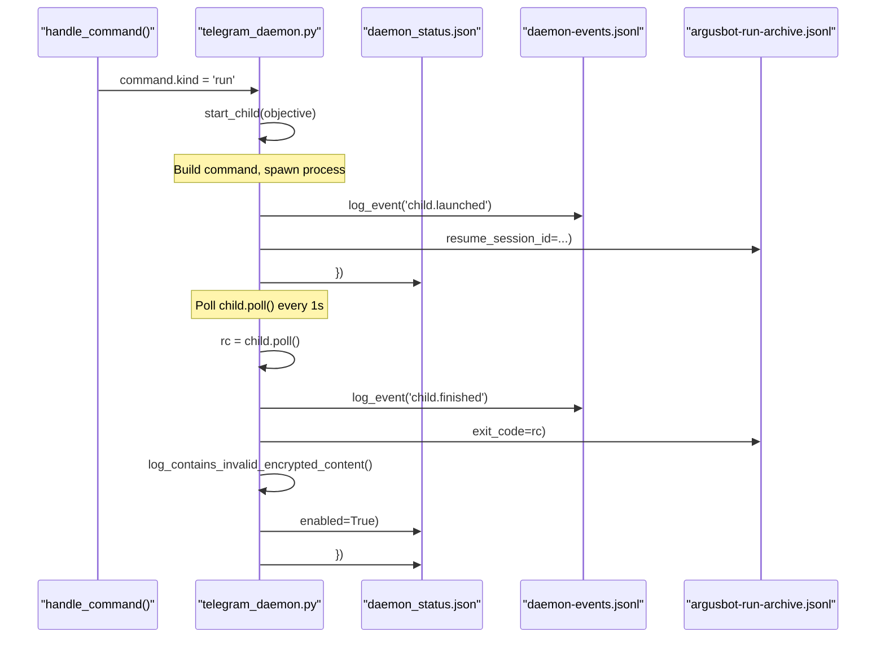

# State Management and Persistence
Relevant source files
- [README.md](https://github.com/waltstephen/ArgusBot/blob/6d0ec9f8/README.md?plain=1)
- [codex_autoloop/telegram_daemon.py](https://github.com/waltstephen/ArgusBot/blob/6d0ec9f8/codex_autoloop/telegram_daemon.py)
- [tests/test_telegram_daemon.py](https://github.com/waltstephen/ArgusBot/blob/6d0ec9f8/tests/test_telegram_daemon.py)

## Purpose and Scope

This page explains how ArgusBot manages runtime state and persists data across execution runs. It covers the various state files (JSON snapshots, JSONL event logs, markdown artifacts), session ID resolution for run continuity, and the `LoopStateStore` component that coordinates all persistence operations.

For information about how state is used during multi-agent execution, see [Multi-Agent Loop System](/waltstephen/ArgusBot/3.4-multi-agent-loop-system). For advanced session resumption scenarios and recovery mechanisms, see [Session Management and Resumption](/waltstephen/ArgusBot/7.1-session-management-and-resumption) and [State Persistence Details](/waltstephen/ArgusBot/7.2-state-persistence-details).

---

## State File Types and Locations

ArgusBot maintains multiple categories of state files, each serving a distinct purpose in the persistence architecture.

### Primary State Files

| File | Type | Purpose | Updated By |
| --- | --- | --- | --- |
| `last_state.json` | JSON snapshot | Current session state, round history, latest review/plan | Loop engine after each round |
| `argusbot-run-archive.jsonl` | JSONL log | Append-only event stream of all runs | Daemon on run start/finish events |
| `daemon_status.json` | JSON snapshot | Daemon operational state, child process info | Daemon on status changes |
| `daemon-events.jsonl` | JSONL log | Daemon lifecycle events, command history | Daemon on events |

### Markdown Artifact Files

| File | Purpose | Writer |
| --- | --- | --- |
| `operator_messages.md` | All operator injections, plan directions, review criteria | State store on operator inputs |
| `main_prompt.md` | Latest prompt sent to main agent | State store before main agent execution |
| `plan_report.md` or `plan_overview.md` | Planner's strategic overview and suggested next objective | Planner agent after sweep |
| `plan_todo.md` | Mirrored TODO list from plan report | CLI mode for convenience |
| `review_summaries/index.md` | Latest reviewer evaluation | Reviewer agent after round |
| `review_summaries/round-NNN.md` | Per-round review history | Reviewer agent after round |

**Sources:**[codex_autoloop/telegram_daemon.py247-250](https://github.com/waltstephen/ArgusBot/blob/6d0ec9f8/codex_autoloop/telegram_daemon.py#L247-L250)[codex_autoloop/apps/daemon_app.py49-51](https://github.com/waltstephen/ArgusBot/blob/6d0ec9f8/codex_autoloop/apps/daemon_app.py#L49-L51)[codex_autoloop/core/state_store.py1-100](https://github.com/waltstephen/ArgusBot/blob/6d0ec9f8/codex_autoloop/core/state_store.py#L1-L100)

---

## Session ID Resolution Strategy

Session continuity is achieved through a two-tier resolution mechanism that enables resuming interrupted work or starting fresh sessions on demand.

### Session ID Resolution Flow

[Flowchart Diagram]

**Sources:**[codex_autoloop/telegram_daemon.py446-537](https://github.com/waltstephen/ArgusBot/blob/6d0ec9f8/codex_autoloop/telegram_daemon.py#L446-L537)[codex_autoloop/telegram_daemon.py1513-1519](https://github.com/waltstephen/ArgusBot/blob/6d0ec9f8/codex_autoloop/telegram_daemon.py#L1513-L1519)[codex_autoloop/telegram_daemon.py1437-1452](https://github.com/waltstephen/ArgusBot/blob/6d0ec9f8/codex_autoloop/telegram_daemon.py#L1437-L1452)[codex_autoloop/telegram_daemon.py1484-1510](https://github.com/waltstephen/ArgusBot/blob/6d0ec9f8/codex_autoloop/telegram_daemon.py#L1484-L1510)

### Force Fresh Session Mechanism

The `force_fresh_session` flag provides explicit override capability to prevent session resumption:

[Flowchart Diagram]

**Key Constants:**

- `FORCE_FRESH_SESSION_KEY = "force_fresh_session"`
- `FORCE_FRESH_REASON_KEY = "force_fresh_reason"`
- `INVALID_ENCRYPTED_CONTENT_MARKER = "invalid encrypted content"`

**Sources:**[codex_autoloop/telegram_daemon.py43-46](https://github.com/waltstephen/ArgusBot/blob/6d0ec9f8/codex_autoloop/telegram_daemon.py#L43-L46)[codex_autoloop/telegram_daemon.py1455-1481](https://github.com/waltstephen/ArgusBot/blob/6d0ec9f8/codex_autoloop/telegram_daemon.py#L1455-L1481)[codex_autoloop/telegram_daemon.py1464-1481](https://github.com/waltstephen/ArgusBot/blob/6d0ec9f8/codex_autoloop/telegram_daemon.py#L1464-L1481)[codex_autoloop/telegram_daemon.py1139-1162](https://github.com/waltstephen/ArgusBot/blob/6d0ec9f8/codex_autoloop/telegram_daemon.py#L1139-L1162)[codex_autoloop/telegram_daemon.py1522-1535](https://github.com/waltstephen/ArgusBot/blob/6d0ec9f8/codex_autoloop/telegram_daemon.py#L1522-L1535)

---

## State Persistence Functions and Data Flow

State persistence is handled by utility functions in `daemon_bus.py` and coordinated by daemon and CLI mode entry points.

### Core State I/O Functions

[Flowchart Diagram]

**Sources:**[codex_autoloop/daemon_bus.py1-100](https://github.com/waltstephen/ArgusBot/blob/6d0ec9f8/codex_autoloop/daemon_bus.py#L1-L100)[codex_autoloop/telegram_daemon.py398-444](https://github.com/waltstephen/ArgusBot/blob/6d0ec9f8/codex_autoloop/telegram_daemon.py#L398-L444)

### Key LoopStateStore Methods

| Method | Purpose | When Called |
| --- | --- | --- |
| `record_message(text, source, kind)` | Append to operator_messages.md and state payload | On operator inject, plan direction, review criteria |
| `write_state_snapshot(session_id, rounds)` | Write complete state to last_state.json | After each round completes |
| `write_main_prompt_markdown(content)` | Write main agent prompt to file | Before main agent execution |
| `write_plan_overview_markdown(content)` | Write planner output to file | After planner sweep |
| `write_review_summaries_markdown(review, round_index)` | Write reviewer output to files | After reviewer evaluation |
| `request_inject(text, source)` | Queue operator injection | On `/inject` command |
| `request_plan_direction(text, source)` | Queue plan-only direction | On `/plan` command |
| `request_review_criteria(text, source)` | Queue review-only criteria | On `/review` command |
| `check_for_stop_request()` | Check if `/stop` was issued | Every round before main execution |

**Sources:**[codex_autoloop/core/state_store.py100-400](https://github.com/waltstephen/ArgusBot/blob/6d0ec9f8/codex_autoloop/core/state_store.py#L100-L400)

---

## State Persistence Lifecycle

State is written at strategic points throughout the execution lifecycle to ensure recoverability and auditability.

### Daemon State Update Points



**Key Functions:**

- `update_status()` at [codex_autoloop/telegram_daemon.py398-444](https://github.com/waltstephen/ArgusBot/blob/6d0ec9f8/codex_autoloop/telegram_daemon.py#L398-L444)
- `log_event()` at [codex_autoloop/telegram_daemon.py344-351](https://github.com/waltstephen/ArgusBot/blob/6d0ec9f8/codex_autoloop/telegram_daemon.py#L344-L351)
- `append_run_archive_record()` at [codex_autoloop/telegram_daemon.py353-363](https://github.com/waltstephen/ArgusBot/blob/6d0ec9f8/codex_autoloop/telegram_daemon.py#L353-L363)

**Sources:**[codex_autoloop/telegram_daemon.py446-537](https://github.com/waltstephen/ArgusBot/blob/6d0ec9f8/codex_autoloop/telegram_daemon.py#L446-L537)[codex_autoloop/telegram_daemon.py1082-1211](https://github.com/waltstephen/ArgusBot/blob/6d0ec9f8/codex_autoloop/telegram_daemon.py#L1082-L1211)

### Daemon Status Payload Schema

The daemon maintains operational state in `daemon_status.json` with the following structure:

```
{
  "updated_at": "2026-01-15T12:34:56Z",
  "daemon_pid": 12345,
  "daemon_running": true,
  "running": true,
  "child_pid": 12346,
  "child_objective": "Implement feature X...",
  "child_log_path": ".argusbot/logs/run-20260115-123456-789012.log",
  "child_main_prompt_path": ".argusbot/logs/run-20260115-123456-789012-main-prompt.md",
  "child_plan_report_path": ".argusbot/logs/run-20260115-123456-789012-plan-report.md",
  "child_plan_todo_path": ".argusbot/logs/run-20260115-123456-789012-todo.md",
  "child_review_summaries_dir": ".argusbot/logs/run-20260115-123456-789012-review/",
  "child_started_at": "2026-01-15T12:34:56Z",
  "last_session_id": "thread-20260115-123456-789012",
  "force_fresh_session": false,
  "run_cwd": "/path/to/workspace",
  "logs_dir": ".argusbot/logs",
  "bus_dir": ".argusbot/bus",
  "events_log": ".argusbot/logs/daemon-events.jsonl",
  "run_archive_log": ".argusbot/logs/argusbot-run-archive.jsonl",
  "operator_messages_file": ".argusbot/logs/operator_messages.md",
  "plan_mode": "auto",
  "default_plan_mode": "auto",
  "btw_busy": false,
  "btw_session_id": null,
  "pending_plan_request": null,
  "pending_plan_generated_at": null,
  "pending_plan_auto_execute_at": null,
  "scheduled_plan_request_at": null
}
```

**Update Function:**`update_status()` at [codex_autoloop/telegram_daemon.py398-444](https://github.com/waltstephen/ArgusBot/blob/6d0ec9f8/codex_autoloop/telegram_daemon.py#L398-L444) writes this payload after:

- Child process launch
- Child process finish
- Command handling
- Every main loop iteration

**Sources:**[codex_autoloop/telegram_daemon.py398-444](https://github.com/waltstephen/ArgusBot/blob/6d0ec9f8/codex_autoloop/telegram_daemon.py#L398-L444)

---

## Operator Messages and Audit Trail

All operator interactions are logged to `operator_messages.md`, creating a comprehensive audit trail that persists across runs. This file is passed to child processes via `--operator-messages-file` argument.

### Operator Messages Write Flow

[Flowchart Diagram]

**File Format Example:**

```
- timestamp: 2026-01-15T12:34:56Z
- source: telegram
- kind: broadcast
- text: Implement user authentication system
 
- timestamp: 2026-01-15T12:45:23Z
- source: terminal
- kind: inject
- text: Add rate limiting to login endpoint
```

**Sources:**[codex_autoloop/telegram_daemon.py470-521](https://github.com/waltstephen/ArgusBot/blob/6d0ec9f8/codex_autoloop/telegram_daemon.py#L470-L521)[codex_autoloop/telegram_daemon.py634-641](https://github.com/waltstephen/ArgusBot/blob/6d0ec9f8/codex_autoloop/telegram_daemon.py#L634-L641)

---

## State Payload Schema

The `last_state.json` file contains a structured payload with the following schema:

### Top-Level Fields

```
{
  "session_id": "thread-20260115-123456-789012",
  "objective": "Implement user authentication system",
  "rounds": [...],
  "latest_review_status": "continue",
  "latest_plan": {
    "follow_up_required": true,
    "main_instruction": "Next objective text"
  },
  "force_fresh_session": false,
  "force_fresh_reason": null
}
```

### Round Data Structure

Each entry in the `rounds` array contains:

```
{
  "round": 3,
  "thread_id": "thread-20260115-123456-789012",
  "main_exit_code": 0,
  "main_turn_completed": true,
  "main_turn_failed": false,
  "checks": [
    {"command": "pytest -q", "passed": true, "output": "..."}
  ],
  "review": {
    "status": "continue",
    "confidence": "high",
    "reason": "Tests passing but documentation incomplete",
    "next_action": "Add API documentation"
  },
  "plan": {
    "next_explore": ["Document REST endpoints", "Add usage examples"],
    "follow_up_required": true
  }
}
```

**Sources:**[codex_autoloop/core/state_store.py50-150](https://github.com/waltstephen/ArgusBot/blob/6d0ec9f8/codex_autoloop/core/state_store.py#L50-L150)[codex_autoloop/telegram_daemon.py906-939](https://github.com/waltstephen/ArgusBot/blob/6d0ec9f8/codex_autoloop/telegram_daemon.py#L906-L939)

---

## Recovery Mechanisms

ArgusBot implements multiple recovery mechanisms to handle common failure scenarios.

### Invalid Encrypted Content Recovery

When OpenAI API errors with "invalid encrypted content" (usually due to token corruption), the daemon automatically arms the force-fresh flag:

[Flowchart Diagram]

**Constants and Functions:**

- `INVALID_ENCRYPTED_CONTENT_MARKER = "invalid encrypted content"` at [codex_autoloop/telegram_daemon.py45](https://github.com/waltstephen/ArgusBot/blob/6d0ec9f8/codex_autoloop/telegram_daemon.py#L45-L45)
- `log_contains_invalid_encrypted_content()` at [codex_autoloop/telegram_daemon.py1522-1535](https://github.com/waltstephen/ArgusBot/blob/6d0ec9f8/codex_autoloop/telegram_daemon.py#L1522-L1535)
- `set_force_fresh_session_marker()` at [codex_autoloop/telegram_daemon.py1464-1481](https://github.com/waltstephen/ArgusBot/blob/6d0ec9f8/codex_autoloop/telegram_daemon.py#L1464-L1481)

**Sources:**[codex_autoloop/telegram_daemon.py1139-1162](https://github.com/waltstephen/ArgusBot/blob/6d0ec9f8/codex_autoloop/telegram_daemon.py#L1139-L1162)[codex_autoloop/telegram_daemon.py1522-1535](https://github.com/waltstephen/ArgusBot/blob/6d0ec9f8/codex_autoloop/telegram_daemon.py#L1522-L1535)[codex_autoloop/telegram_daemon.py45](https://github.com/waltstephen/ArgusBot/blob/6d0ec9f8/codex_autoloop/telegram_daemon.py#L45-L45)

### Archive-Based Session Recovery

If `last_state.json` is corrupted or missing, the archive log provides fallback session resolution:

[Flowchart Diagram]

**Archive Event Examples:**

```
{"ts": "2026-01-15T12:34:56Z", "event": "run.started", "resume_session_id": "thread-old", "run_id": "20260115-123456-789012"}
{"ts": "2026-01-15T12:45:23Z", "event": "run.finished", "session_id": "thread-new", "exit_code": 0, "run_id": "20260115-123456-789012"}
```

The function scans backwards from the end, prioritizing `session_id` over `resume_session_id`, ensuring the most recent completed session is recovered.

**Sources:**[codex_autoloop/telegram_daemon.py1484-1510](https://github.com/waltstephen/ArgusBot/blob/6d0ec9f8/codex_autoloop/telegram_daemon.py#L1484-L1510)[tests/test_telegram_daemon.py286-310](https://github.com/waltstephen/ArgusBot/blob/6d0ec9f8/tests/test_telegram_daemon.py#L286-L310)

---

## State File Locations and Conventions

Default state file locations follow a consistent convention:

| File | Default Location | Controlled By |
| --- | --- | --- |
| `last_state.json` | `.argusbot/last_state.json` | `--state-file` arg |
| `operator_messages.md` | `.argusbot/operator_messages.md` | `--operator-messages-file` arg |
| `main_prompt.md` | `<logs_dir>/run-{timestamp}-main_prompt.md` | `--main-prompt-file` arg |
| `plan_overview.md` | `<logs_dir>/run-{timestamp}-plan_overview.md` | `--plan-overview-file` arg |
| `review_summaries/` | `<logs_dir>/run-{timestamp}-review/` | `--review-summaries-dir` arg |
| `argusbot-run-archive.jsonl` | `<logs_dir>/argusbot-run-archive.jsonl` | Daemon-managed |
| `daemon_status.json` | `<bus_dir>/daemon_status.json` | Daemon-managed |
| `daemon-events.jsonl` | `<logs_dir>/daemon-events.jsonl` | Daemon-managed |

In daemon mode, `<logs_dir>` defaults to `--logs-dir` (usually `.argusbot/logs`), and artifact files are timestamped per run for history preservation.

**Sources:**[codex_autoloop/telegram_daemon.py242-250](https://github.com/waltstephen/ArgusBot/blob/6d0ec9f8/codex_autoloop/telegram_daemon.py#L242-L250)[codex_autoloop/apps/daemon_app.py44-51](https://github.com/waltstephen/ArgusBot/blob/6d0ec9f8/codex_autoloop/apps/daemon_app.py#L44-L51)[codex_autoloop/apps/cli_app.py49-71](https://github.com/waltstephen/ArgusBot/blob/6d0ec9f8/codex_autoloop/apps/cli_app.py#L49-L71)