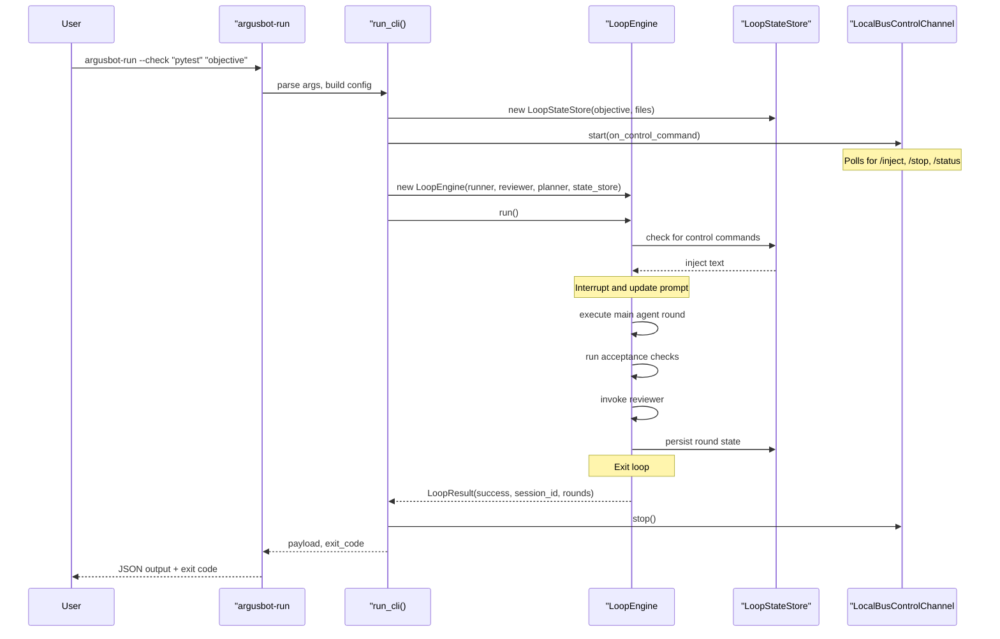
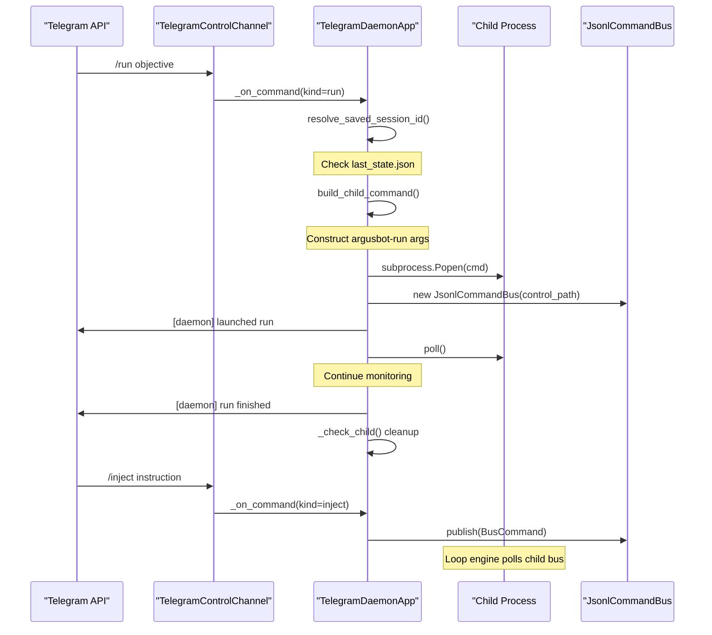

# System Overview
Relevant source files
- [README.md](https://github.com/waltstephen/ArgusBot/blob/6d0ec9f8/README.md?plain=1)
- [codex_autoloop/apps/cli_app.py](https://github.com/waltstephen/ArgusBot/blob/6d0ec9f8/codex_autoloop/apps/cli_app.py)
- [codex_autoloop/apps/daemon_app.py](https://github.com/waltstephen/ArgusBot/blob/6d0ec9f8/codex_autoloop/apps/daemon_app.py)
- [codex_autoloop/telegram_daemon.py](https://github.com/waltstephen/ArgusBot/blob/6d0ec9f8/codex_autoloop/telegram_daemon.py)

## Purpose and Scope

This page describes the high-level architecture of ArgusBot, focusing on the two operational modes (daemon and CLI), core component relationships, and execution flow patterns. It provides an architectural overview of how the system is structured and how major components interact.

For detailed information about specific subsystems, see:

- Daemon mode details: [Daemon Mode Architecture](/waltstephen/ArgusBot/3.2-daemon-mode-architecture)
- CLI mode details: [CLI Mode Architecture](/waltstephen/ArgusBot/3.3-cli-mode-architecture)
- Multi-agent loop mechanics: [Multi-Agent Loop System](/waltstephen/ArgusBot/3.4-multi-agent-loop-system)
- State persistence mechanisms: [State Management and Persistence](/waltstephen/ArgusBot/3.5-state-management-and-persistence)

---

## Operational Modes

ArgusBot operates in one of two distinct modes: **daemon mode** for persistent background operation with remote control, or **CLI mode** for single-run execution with direct terminal interaction.

### Daemon Mode

Daemon mode provides persistent, always-on operation suitable for 24/7 remote control via Telegram or Feishu. The daemon process acts as a supervisor that spawns child processes to execute individual runs.

**Key characteristics:**

- Persistent background process (survives across multiple runs)
- Remote control via Telegram/Feishu commands (`/run`, `/inject`, `/stop`)
- Session continuity and resumption across runs
- Automatic follow-up execution based on planner proposals
- Child process lifecycle management

**Primary entry point:**`argusbot-daemon` command**Implementation:**`TelegramDaemonApp` class in [codex_autoloop/apps/daemon_app.py40-546](https://github.com/waltstephen/ArgusBot/blob/6d0ec9f8/codex_autoloop/apps/daemon_app.py#L40-L546)

### CLI Mode

CLI mode provides direct single-run execution from the terminal, suitable for interactive development and debugging.

**Key characteristics:**

- Single-run execution (process exits when loop completes)
- Direct terminal control and output
- Optional Telegram/Feishu notifications (but not control)
- Immediate execution without supervisor overhead
- Local control file support for in-run commands

**Primary entry point:**`argusbot-run` command**Implementation:**`run_cli` function in [codex_autoloop/apps/cli_app.py42-492](https://github.com/waltstephen/ArgusBot/blob/6d0ec9f8/codex_autoloop/apps/cli_app.py#L42-L492)

### Mode Comparison

| Aspect | Daemon Mode | CLI Mode |
| --- | --- | --- |
| **Process Lifecycle** | Persistent supervisor + ephemeral child processes | Single process per run |
| **Control Channels** | Telegram/Feishu polling + local bus | Local bus + optional Telegram/Feishu notifications |
| **Session Continuity** | Automatic session resumption across runs | Explicit `--session-id` flag |
| **Typical Use Case** | 24/7 remote operation, automated workflows | Interactive development, debugging |
| **Entry Point** | `argusbot-daemon` | `argusbot-run` |
| **Configuration** | `.argusbot/daemon_config.json` | CLI arguments only |

**Sources:**[README.md32-86](https://github.com/waltstephen/ArgusBot/blob/6d0ec9f8/README.md?plain=1#L32-L86)[codex_autoloop/apps/daemon_app.py40-546](https://github.com/waltstephen/ArgusBot/blob/6d0ec9f8/codex_autoloop/apps/daemon_app.py#L40-L546)[codex_autoloop/apps/cli_app.py42-492](https://github.com/waltstephen/ArgusBot/blob/6d0ec9f8/codex_autoloop/apps/cli_app.py#L42-L492)

---

## Core Architecture Components

### Entry Points and Command Routing

**Diagram: Entry Points and Mode Selection**

[Flowchart Diagram]

**Sources:**[README.md129-167](https://github.com/waltstephen/ArgusBot/blob/6d0ec9f8/README.md?plain=1#L129-L167)[codex_autoloop/cli.py32-70](https://github.com/waltstephen/ArgusBot/blob/6d0ec9f8/codex_autoloop/cli.py#L32-L70)[codex_autoloop/apps/daemon_app.py384-440](https://github.com/waltstephen/ArgusBot/blob/6d0ec9f8/codex_autoloop/apps/daemon_app.py#L384-L440)

### Component Hierarchy

**Diagram: Core Component Relationships**

[Flowchart Diagram]

**Sources:**[codex_autoloop/apps/cli_app.py1-493](https://github.com/waltstephen/ArgusBot/blob/6d0ec9f8/codex_autoloop/apps/cli_app.py#L1-L493)[codex_autoloop/apps/daemon_app.py1-929](https://github.com/waltstephen/ArgusBot/blob/6d0ec9f8/codex_autoloop/apps/daemon_app.py#L1-L929)[codex_autoloop/core/engine.py](https://github.com/waltstephen/ArgusBot/blob/6d0ec9f8/codex_autoloop/core/engine.py)

---

## Component Responsibilities

### TelegramDaemonApp / run_cli

The application layer manages the operational mode and coordinates control channels, event sinks, and the loop engine.

| Class/Function | File | Responsibility |
| --- | --- | --- |
| `TelegramDaemonApp` | `apps/daemon_app.py` | Daemon supervisor: manages child processes, routes commands, handles Telegram/Feishu polling |
| `run_cli()` | `apps/cli_app.py` | CLI execution orchestrator: configures components, runs `LoopEngine`, returns results |

**Key methods in TelegramDaemonApp:**

- `_on_command()`[daemon_app.py187-383](https://github.com/waltstephen/ArgusBot/blob/6d0ec9f8/daemon_app.py#L187-L383) - Routes incoming commands to appropriate handlers
- `_start_child()`[daemon_app.py384-440](https://github.com/waltstephen/ArgusBot/blob/6d0ec9f8/daemon_app.py#L384-L440) - Spawns child process with `argusbot-run`
- `_check_child()`[daemon_app.py460-480](https://github.com/waltstephen/ArgusBot/blob/6d0ec9f8/daemon_app.py#L460-L480) - Monitors child process completion

**Sources:**[codex_autoloop/apps/daemon_app.py40-929](https://github.com/waltstephen/ArgusBot/blob/6d0ec9f8/codex_autoloop/apps/daemon_app.py#L40-L929)[codex_autoloop/apps/cli_app.py42-492](https://github.com/waltstephen/ArgusBot/blob/6d0ec9f8/codex_autoloop/apps/cli_app.py#L42-L492)

### LoopEngine

The `LoopEngine` class orchestrates the multi-agent execution loop. It manages round execution, coordinates agents, and enforces stop conditions.

**Key responsibilities:**

- Execute main agent rounds via `CodexRunner`
- Run acceptance checks between rounds
- Invoke reviewer agent for quality gating
- Trigger planner agent for background sweeps
- Detect and handle stalls via `StallAgent`
- Emit events to `EventSink`
- Respond to control commands from `StateStore`

**Location:**`core/engine.py`

**Sources:** Referenced in [codex_autoloop/apps/cli_app.py427-456](https://github.com/waltstephen/ArgusBot/blob/6d0ec9f8/codex_autoloop/apps/cli_app.py#L427-L456)

### StateStore

The `LoopStateStore` class manages all persistent state and operator interactions.

**Key responsibilities:**

- Persist round-by-round state to JSON file (`--state-file`)
- Record operator messages to markdown (`operator_messages.md`)
- Write plan reports and review summaries
- Handle control commands (`inject`, `plan`, `review`, `stop`, `mode`)
- Provide state snapshots for status queries

**Location:**`core/state_store.py`

**Sources:**[codex_autoloop/apps/cli_app.py72-81](https://github.com/waltstephen/ArgusBot/blob/6d0ec9f8/codex_autoloop/apps/cli_app.py#L72-L81)

### CodexRunner

The `CodexRunner` class manages subprocess execution of the Codex CLI binary.

**Key responsibilities:**

- Execute `codex exec` and `codex exec resume` commands
- Parse JSONL output stream
- Monitor watchdog for stalls
- Apply provider overrides for copilot-proxy
- Stream events to callbacks

**Location:**`codex_runner.py`

**Sources:**[codex_autoloop/apps/cli_app.py420-424](https://github.com/waltstephen/ArgusBot/blob/6d0ec9f8/codex_autoloop/apps/cli_app.py#L420-L424)

### Agent Components

| Agent | File | Purpose |
| --- | --- | --- |
| `Reviewer` | `reviewer.py` | Quality gate: evaluates completion with `done`/`continue`/`blocked` verdict |
| `Planner` | `planner.py` | Strategic overview: maintains plan reports, TODO lists, proposes follow-ups |
| `StallAgent` | `stall_agent.py` | Watchdog monitor: diagnoses stalls and decides if restart is needed |
| `BtwAgent` | `btw_agent.py` | Side-agent: handles read-only questions without interrupting main execution |

**Sources:**[codex_autoloop/apps/cli_app.py425-426](https://github.com/waltstephen/ArgusBot/blob/6d0ec9f8/codex_autoloop/apps/cli_app.py#L425-L426)[codex_autoloop/apps/daemon_app.py70-92](https://github.com/waltstephen/ArgusBot/blob/6d0ec9f8/codex_autoloop/apps/daemon_app.py#L70-L92)

---

## Execution Flow Patterns

### CLI Mode Execution Flow

**Diagram: Single-Run CLI Execution**



**Sources:**[codex_autoloop/cli.py32-70](https://github.com/waltstephen/ArgusBot/blob/6d0ec9f8/codex_autoloop/cli.py#L32-L70)[codex_autoloop/apps/cli_app.py42-492](https://github.com/waltstephen/ArgusBot/blob/6d0ec9f8/codex_autoloop/apps/cli_app.py#L42-L492)

### Daemon Mode Execution Flow

**Diagram: Daemon Child Process Lifecycle**



**Sources:**[codex_autoloop/apps/daemon_app.py187-440](https://github.com/waltstephen/ArgusBot/blob/6d0ec9f8/codex_autoloop/apps/daemon_app.py#L187-L440)[codex_autoloop/apps/daemon_app.py460-480](https://github.com/waltstephen/ArgusBot/blob/6d0ec9f8/codex_autoloop/apps/daemon_app.py#L460-L480)

---

## Control and Communication Architecture

### Control Channels

ArgusBot supports multiple control channels for receiving commands during execution:

**Diagram: Control Channel Types and Routing**

[Flowchart Diagram]

**Control channel implementation details:**

| Channel Class | Poll Mechanism | Location |
| --- | --- | --- |
| `TelegramControlChannel` | Long-polling `getUpdates` (20s timeout, 2s interval) | `adapters/control_channels.py` |
| `FeishuControlChannel` | Poll messages API (2s interval) | `adapters/control_channels.py` |
| `LocalBusControlChannel` | Poll JSONL file (1s interval) | `adapters/control_channels.py` |

**Sources:**[codex_autoloop/apps/daemon_app.py165-185](https://github.com/waltstephen/ArgusBot/blob/6d0ec9f8/codex_autoloop/apps/daemon_app.py#L165-L185)[codex_autoloop/apps/cli_app.py158-229](https://github.com/waltstephen/ArgusBot/blob/6d0ec9f8/codex_autoloop/apps/cli_app.py#L158-L229)

### Event Sinks

Event sinks handle output notifications and progress updates:

**Diagram: Event Sink Architecture**

[Flowchart Diagram]

**Event types handled:**

- `loop.started`, `loop.completed`
- `round.started`, `round.review.completed`
- `agent.message` (streamed output from main/reviewer/planner)
- `check.started`, `check.completed`
- `stall.detected`, `stall.restart`

**Sources:**[codex_autoloop/apps/cli_app.py84-218](https://github.com/waltstephen/ArgusBot/blob/6d0ec9f8/codex_autoloop/apps/cli_app.py#L84-L218)[codex_autoloop/adapters/event_sinks.py](https://github.com/waltstephen/ArgusBot/blob/6d0ec9f8/codex_autoloop/adapters/event_sinks.py)

---

## State Persistence

ArgusBot persists state across multiple layers to support session resumption and comprehensive audit trails.

**Diagram: State Files and Their Relationships**

[Flowchart Diagram]

**State file purposes:**

| File | Written By | Purpose | Read By |
| --- | --- | --- | --- |
| `last_state.json` | `LoopStateStore` | Round-by-round state, session_id | Daemon for resumption |
| `operator_messages.md` | `LoopStateStore` | All operator inputs (inject/plan/review) | Reviewer, Planner |
| `main_prompt.md` | `LoopStateStore` | Latest main agent prompt | User inspection |
| `plan_report.md` | `Planner` | Strategic overview, workstreams | User inspection |
| `review_summaries/` | `Reviewer` | Per-round review verdicts | User inspection |
| `daemon_status.json` | `TelegramDaemonApp` | Daemon + child runtime status | Status queries |
| `daemon-events.jsonl` | `TelegramDaemonApp` | Command and lifecycle events | Audit trails |
| `argusbot-run-archive.jsonl` | `LoopStateStore` | Run completion metadata | Session resolution |

**Session resolution logic:**

1. Check `next_run_new_session.flag` - if set, force fresh session
2. Read `last_state.json` for `session_id` - if found, resume
3. Check `argusbot-run-archive.jsonl` for last `run.finished` event with `session_id`
4. Otherwise, start fresh session

**Sources:**[codex_autoloop/apps/daemon_app.py717-726](https://github.com/waltstephen/ArgusBot/blob/6d0ec9f8/codex_autoloop/apps/daemon_app.py#L717-L726)[codex_autoloop/apps/daemon_app.py777-803](https://github.com/waltstephen/ArgusBot/blob/6d0ec9f8/codex_autoloop/apps/daemon_app.py#L777-L803)

---

## External Service Integrations

ArgusBot integrates with several external services for execution, control, and notifications.

**Diagram: External Service Integration Points**

[Flowchart Diagram]

**Integration details:**

| Service | Integration Method | Configuration |
| --- | --- | --- |
| Codex CLI | Subprocess execution with JSONL stream parsing | `--codex-bin` path |
| Telegram | HTTP API polling (getUpdates) and posting (sendMessage) | `--telegram-bot-token`, `--telegram-chat-id` |
| Feishu | HTTP API polling and posting with tenant auth | `--feishu-app-id`, `--feishu-app-secret`, `--feishu-chat-id` |
| copilot-proxy | Auto-detected/installed proxy, runtime provider overrides | `--copilot-proxy`, `--copilot-proxy-dir` |
| Whisper API | Voice/audio transcription via OpenAI-compatible endpoint | `--telegram-control-whisper-api-key` |

**Sources:**[codex_autoloop/copilot_proxy.py](https://github.com/waltstephen/ArgusBot/blob/6d0ec9f8/codex_autoloop/copilot_proxy.py)[codex_autoloop/telegram_notifier.py](https://github.com/waltstephen/ArgusBot/blob/6d0ec9f8/codex_autoloop/telegram_notifier.py)[codex_autoloop/feishu_adapter.py](https://github.com/waltstephen/ArgusBot/blob/6d0ec9f8/codex_autoloop/feishu_adapter.py)

---

## Configuration Sources

ArgusBot configuration can come from multiple sources with a clear precedence hierarchy.

**Configuration precedence (highest to lowest):**

1. **CLI arguments** - Explicit flags passed to `argusbot-run`
2. **Daemon config** - `daemon_config.json` for daemon-launched runs
3. **Model presets** - Named presets like `quality`, `balanced`, `copilot`
4. **Codex CLI defaults** - Global Codex configuration in `~/.codex/config.toml`

**Key configuration files:**

| File | Location | Purpose |
| --- | --- | --- |
| `daemon_config.json` | `.argusbot/` | Persistent daemon configuration (channels, models, planner mode) |
| `daemon.pid` | `.argusbot/` | Daemon process ID for lock enforcement |
| `~/.codex/config.toml` | User home | Global Codex CLI settings (inherited when no explicit model set) |

**Daemon configuration structure (example):**

```
{
  "telegram_bot_token": "123456:ABC...",
  "telegram_chat_id": "987654321",
  "run_model_preset": "quality",
  "run_plan_mode": "auto",
  "run_check": ["pytest -q"],
  "run_yolo": true,
  "run_max_rounds": 500
}
```

**Sources:**[codex_autoloop/apps/daemon_app.py41-93](https://github.com/waltstephen/ArgusBot/blob/6d0ec9f8/codex_autoloop/apps/daemon_app.py#L41-L93)[README.md454-489](https://github.com/waltstephen/ArgusBot/blob/6d0ec9f8/README.md?plain=1#L454-L489)

---

## Summary

ArgusBot's architecture provides two complementary operational modes:

- **Daemon mode** for persistent background operation with remote control and session continuity
- **CLI mode** for direct single-run execution with immediate terminal feedback

The separation of concerns between the daemon supervisor (`TelegramDaemonApp`) and the execution engine (`LoopEngine`) enables flexible deployment while maintaining a consistent core execution model. State persistence across JSON and markdown files provides comprehensive audit trails and enables session resumption. Multiple control channels (Telegram, Feishu, local bus) and event sinks (terminal, notifications, dashboard) offer flexible interaction patterns for different operational contexts.

For deeper exploration of specific subsystems, see the related architecture pages: [Daemon Mode Architecture](/waltstephen/ArgusBot/3.2-daemon-mode-architecture), [CLI Mode Architecture](/waltstephen/ArgusBot/3.3-cli-mode-architecture), [Multi-Agent Loop System](/waltstephen/ArgusBot/3.4-multi-agent-loop-system), and [State Management and Persistence](/waltstephen/ArgusBot/3.5-state-management-and-persistence).

**Sources:**[README.md1-638](https://github.com/waltstephen/ArgusBot/blob/6d0ec9f8/README.md?plain=1#L1-L638)[codex_autoloop/apps/daemon_app.py1-929](https://github.com/waltstephen/ArgusBot/blob/6d0ec9f8/codex_autoloop/apps/daemon_app.py#L1-L929)[codex_autoloop/apps/cli_app.py1-493](https://github.com/waltstephen/ArgusBot/blob/6d0ec9f8/codex_autoloop/apps/cli_app.py#L1-L493)