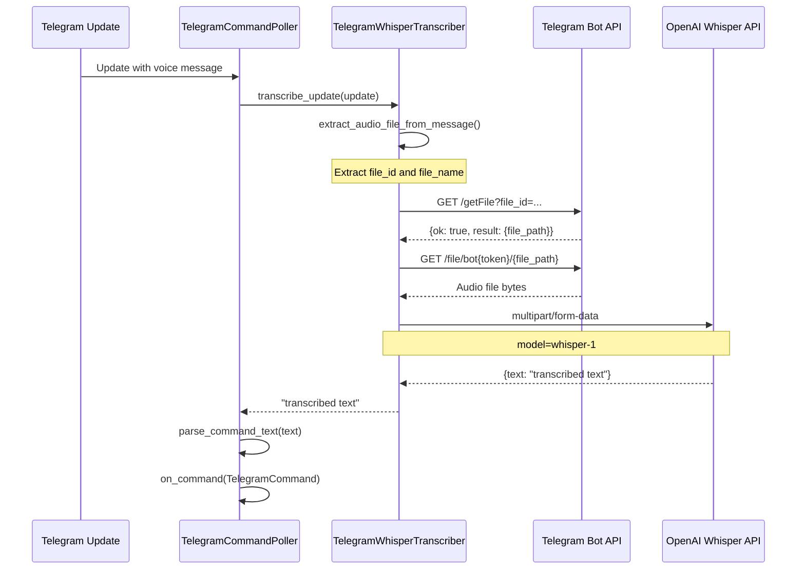

# Telegram Integration
Relevant source files
- [codex_autoloop/daemon_ctl.py](https://github.com/waltstephen/ArgusBot/blob/6d0ec9f8/codex_autoloop/daemon_ctl.py)
- [codex_autoloop/setup_wizard.py](https://github.com/waltstephen/ArgusBot/blob/6d0ec9f8/codex_autoloop/setup_wizard.py)
- [codex_autoloop/telegram_control.py](https://github.com/waltstephen/ArgusBot/blob/6d0ec9f8/codex_autoloop/telegram_control.py)
- [codex_autoloop/telegram_daemon.py](https://github.com/waltstephen/ArgusBot/blob/6d0ec9f8/codex_autoloop/telegram_daemon.py)
- [tests/test_setup_wizard.py](https://github.com/waltstephen/ArgusBot/blob/6d0ec9f8/tests/test_setup_wizard.py)
- [tests/test_telegram_control.py](https://github.com/waltstephen/ArgusBot/blob/6d0ec9f8/tests/test_telegram_control.py)

## Purpose and Scope

This page documents the Telegram integration subsystem, which enables remote control and monitoring of ArgusBot through Telegram's Bot API. The integration provides bidirectional communication: users send commands via Telegram messages (including voice), and the system sends event notifications and status updates back to the chat.

For general information about control channels, see [Command Channels Overview](/waltstephen/ArgusBot/5.1-command-system-overview). For Feishu integration details, see [Feishu Integration](/waltstephen/ArgusBot/5.3-feishu-integration). For local terminal-based control, see [Local Control](/waltstephen/ArgusBot/5.4-local-control).

---

## Architecture Overview

The Telegram integration consists of two primary components working in tandem:

1. **Command Input**: `TelegramCommandPoller` continuously polls the Telegram Bot API for incoming messages and converts them into normalized `TelegramCommand` objects
2. **Event Output**: `TelegramNotifier` sends formatted event notifications, status updates, and file attachments back to the configured chat

Both components operate asynchronously in separate threads managed by the daemon process.

[Flowchart Diagram]

**Sources**: [codex_autoloop/telegram_control.py1-526](https://github.com/waltstephen/ArgusBot/blob/6d0ec9f8/codex_autoloop/telegram_control.py#L1-L526)[codex_autoloop/telegram_notifier.py1-430](https://github.com/waltstephen/ArgusBot/blob/6d0ec9f8/codex_autoloop/telegram_notifier.py#L1-L430)

---

## Bot Setup and Configuration

### Creating a Telegram Bot

Telegram bots are created through [@BotFather](https://t.me/botfather):

1. Send `/newbot` to BotFather
2. Provide a display name and username
3. Receive a bot token in the format `123456789:ABCdefGHIjklMNOpqrsTUVwxyz`

The bot token is used to authenticate API requests. It must be kept confidential.

### Configuration Parameters

Telegram integration is configured through `daemon_config.json` or CLI arguments:

| Parameter | Type | Default | Description |
| --- | --- | --- | --- |
| `telegram_bot_token` | string | required | Bot token from BotFather |
| `telegram_chat_id` | string | `"auto"` | Target chat ID; `"auto"` resolves from first message |
| `telegram_events` | set[string] | selected events | Event types to send as notifications |
| `telegram_control_enabled` | bool | `true` | Enable command polling |
| `telegram_control_whisper_enabled` | bool | `true` | Enable voice transcription |
| `telegram_control_whisper_api_key` | string | from env | OpenAI API key for Whisper |
| `telegram_timeout_seconds` | int | `10` | HTTP request timeout |
| `telegram_typing_enabled` | bool | `true` | Send typing indicator during runs |

**Sources**: [QUICKSTART.md66-82](https://github.com/waltstephen/ArgusBot/blob/6d0ec9f8/QUICKSTART.md?plain=1#L66-L82)[codex_autoloop/telegram_notifier.py19-27](https://github.com/waltstephen/ArgusBot/blob/6d0ec9f8/codex_autoloop/telegram_notifier.py#L19-L27)[codex_autoloop/telegram_control.py166-180](https://github.com/waltstephen/ArgusBot/blob/6d0ec9f8/codex_autoloop/telegram_control.py#L166-L180)

### Chat ID Resolution

When `chat_id` is set to `"auto"`, the system resolves it dynamically by polling for updates and extracting the chat ID from the first message received. This simplifies setup by avoiding manual chat ID lookup.

The `resolve_chat_id()` function polls `getUpdates` for up to 90 seconds, checking multiple message types (regular messages, edited messages, callback queries, etc.) to extract the chat ID.

[Flowchart Diagram]

**Supported message paths** for chat ID extraction:

- `message.chat.id`
- `edited_message.chat.id`
- `channel_post.chat.id`
- `edited_channel_post.chat.id`
- `my_chat_member.chat.id`
- `chat_member.chat.id`
- `chat_join_request.chat.id`
- `callback_query.message.chat.id`

**Sources**: [codex_autoloop/telegram_notifier.py250-332](https://github.com/waltstephen/ArgusBot/blob/6d0ec9f8/codex_autoloop/telegram_notifier.py#L250-L332)

---

## Command Polling System

### TelegramCommandPoller

`TelegramCommandPoller` runs in a background thread, continuously polling the Telegram Bot API for updates using the long-polling mechanism. It converts incoming messages into normalized `TelegramCommand` objects and forwards them to a callback handler.

#### Initialization Parameters

| Parameter | Type | Default | Description |
| --- | --- | --- | --- |
| `bot_token` | str | required | Telegram bot token |
| `chat_id` | str | required | Expected chat ID (filters messages) |
| `on_command` | CommandCallback | required | Callback for parsed commands |
| `on_error` | ErrorCallback \| None | None | Error logging callback |
| `poll_interval_seconds` | int | `2` | Interval between poll attempts |
| `long_poll_timeout_seconds` | int | `20` | getUpdates timeout parameter |
| `plain_text_as_inject` | bool | `true` | Treat plain text as `/inject` |
| `whisper_enabled` | bool | `true` | Enable voice transcription |

**Sources**: [codex_autoloop/telegram_control.py165-204](https://github.com/waltstephen/ArgusBot/blob/6d0ec9f8/codex_autoloop/telegram_control.py#L165-L204)

#### Polling Loop

```

```

**Sources**: [codex_autoloop/telegram_control.py219-253](https://github.com/waltstephen/ArgusBot/blob/6d0ec9f8/codex_autoloop/telegram_control.py#L219-L253)[tests/test_telegram_control.py333-357](https://github.com/waltstephen/ArgusBot/blob/6d0ec9f8/tests/test_telegram_control.py#L333-L357)

### Command Parsing

Commands are parsed from Telegram updates through a two-stage process:

1. **Extract text**: Get command text from `message.text`, `message.caption`, or transcribed voice
2. **Parse command**: Identify command type and extract arguments

#### Command Data Structure

```
@dataclass
class TelegramCommand:
    kind: str  # Command type (e.g., "run", "inject", "stop")
    text: str  # Command argument text
    callback_query_id: str | None = None  # Set for inline keyboard callbacks
```

**Sources**: [codex_autoloop/telegram_control.py16-21](https://github.com/waltstephen/ArgusBot/blob/6d0ec9f8/codex_autoloop/telegram_control.py#L16-L21)

#### Supported Command Types

| Command | Kind | Argument | Description |
| --- | --- | --- | --- |
| `/run <objective>` | `run` | objective text | Start a new run with the given objective |
| `/inject <instruction>` | `inject` | instruction | Inject instruction into active run |
| `/stop` | `stop` | (empty) | Stop the active run |
| `/status` | `status` | (empty) | Request current status |
| `/new` | `new` | (empty) | Set force-fresh-session flag |
| `/fresh` | `fresh-session` | (empty) | Alias for fresh session |
| `/mode <value>` | `mode` | `off`\|`auto`\|`record` | Change planner mode |
| `/mode` | `mode-menu` | (empty) | Display mode selection menu |
| `/btw <question>` | `btw` | question | Ask BTW side-agent |
| `/plan <direction>` | `plan` | direction | Send direction to planner |
| `/review <criteria>` | `review` | criteria | Set review criteria |
| `/show-main-prompt` | `show-main-prompt` | (empty) | Display latest main prompt |
| `/show-plan` | `show-plan` | (empty) | Display plan overview |
| `/show-review [round]` | `show-review` | round number | Display review summary |
| `/help` | `help` | (empty) | Display help message |
| `/daemon-stop` | `daemon-stop` | (empty) | Shutdown daemon |
| Plain text | `inject` | full text | Injected if `plain_text_as_inject=true` |

**Sources**: [codex_autoloop/telegram_control.py420-487](https://github.com/waltstephen/ArgusBot/blob/6d0ec9f8/codex_autoloop/telegram_control.py#L420-L487)[tests/test_telegram_control.py43-227](https://github.com/waltstephen/ArgusBot/blob/6d0ec9f8/tests/test_telegram_control.py#L43-L227)

#### Command Prefix Normalization

The parser handles alternative command prefixes used in some input methods or locales:

| Input | Normalized | Reason |
| --- | --- | --- |
| `／status` | `/status` | Full-width slash (CJK IME) |
| `、help` | `/help` | CJK punctuation |

**Sources**: [codex_autoloop/telegram_control.py490-498](https://github.com/waltstephen/ArgusBot/blob/6d0ec9f8/codex_autoloop/telegram_control.py#L490-L498)[tests/test_telegram_control.py193-205](https://github.com/waltstephen/ArgusBot/blob/6d0ec9f8/tests/test_telegram_control.py#L193-L205)

### Voice Transcription

#### TelegramWhisperTranscriber

Voice and audio messages are automatically transcribed using OpenAI's Whisper API. The transcriber handles three audio message types:

1. **Voice messages**: Telegram voice recordings (`.ogg` format)
2. **Audio files**: Uploaded audio files with MIME type `audio/*`
3. **Documents**: Uploaded files with audio MIME type



**Sources**: [codex_autoloop/telegram_control.py33-163](https://github.com/waltstephen/ArgusBot/blob/6d0ec9f8/codex_autoloop/telegram_control.py#L33-L163)[codex_autoloop/telegram_control.py381-408](https://github.com/waltstephen/ArgusBot/blob/6d0ec9f8/codex_autoloop/telegram_control.py#L381-L408)

#### Audio File Extraction

The `extract_audio_file_from_message()` function checks message fields in priority order:

| Field | Priority | Default Filename |
| --- | --- | --- |
| `voice.file_id` | 1 | `voice.ogg` |
| `audio.file_id` | 2 | Uses `audio.file_name` or `audio.mp3` |
| `document.file_id` (if MIME type starts with `audio/`) | 3 | Uses `document.file_name` or `audio.bin` |

**Sources**: [codex_autoloop/telegram_control.py381-407](https://github.com/waltstephen/ArgusBot/blob/6d0ec9f8/codex_autoloop/telegram_control.py#L381-L407)[tests/test_telegram_control.py282-297](https://github.com/waltstephen/ArgusBot/blob/6d0ec9f8/tests/test_telegram_control.py#L282-L297)

#### Transcription Error Handling

If the OpenAI API key is missing, the transcriber logs an error message **once** (not repeatedly) and skips transcription for all subsequent voice messages. This prevents log spam while maintaining visibility of the issue.

**Sources**: [codex_autoloop/telegram_control.py61-67](https://github.com/waltstephen/ArgusBot/blob/6d0ec9f8/codex_autoloop/telegram_control.py#L61-L67)[tests/test_telegram_control.py300-312](https://github.com/waltstephen/ArgusBot/blob/6d0ec9f8/tests/test_telegram_control.py#L300-L312)

---

## Event Notification System

### TelegramNotifier

`TelegramNotifier` sends formatted event notifications and arbitrary messages to the configured Telegram chat. It supports text messages, typing indicators, and file attachments (images, videos, documents).

#### Initialization

```
@dataclass
class TelegramConfig:
    bot_token: str
    chat_id: str
    events: set[str]
    timeout_seconds: int = 10
    typing_enabled: bool = True
    typing_interval_seconds: int = 4
```

**Sources**: [codex_autoloop/telegram_notifier.py19-27](https://github.com/waltstephen/ArgusBot/blob/6d0ec9f8/codex_autoloop/telegram_notifier.py#L19-L27)

#### Event Filtering and Formatting

The notifier filters events by type, formats them into readable messages, and sends them to Telegram. Only events in the configured `events` set are sent.

**Event formatting examples**:

| Event Type | Message Format |
| --- | --- |
| `loop.started` | `[autoloop] started {timestamp}\nmax_rounds={max_rounds}\nobjective={objective}` |
| `round.review.completed` | `[autoloop] reviewer decision {timestamp}\nround={round} status={status} confidence={confidence}\nreason={reason}\nnext_action={next_action}` |
| `loop.completed` | `[autoloop] completed {timestamp}\nsuccess={success}\nstop_reason={stop_reason}` |
| `plan.finalized` | `[autoloop] planner final {timestamp}\ntrigger={trigger} terminal={terminal}\nsummary={summary}\nnext_objective={next_objective}` |

**Sources**: [codex_autoloop/telegram_notifier.py374-429](https://github.com/waltstephen/ArgusBot/blob/6d0ec9f8/codex_autoloop/telegram_notifier.py#L374-L429)[tests/test_telegram_notifier.py13-55](https://github.com/waltstephen/ArgusBot/blob/6d0ec9f8/tests/test_telegram_notifier.py#L13-L55)

### Typing Indicator

When `typing_enabled=true`, the notifier automatically sends typing indicators during active runs:

1. **Start**: Triggered by `loop.started` event
2. **Loop**: Sends `sendChatAction` with `action=typing` every 4 seconds
3. **Stop**: Triggered by `loop.completed` event

The typing indicator runs in a separate daemon thread that stops when signaled.

**Sources**: [codex_autoloop/telegram_notifier.py128-147](https://github.com/waltstephen/ArgusBot/blob/6d0ec9f8/codex_autoloop/telegram_notifier.py#L128-L147)[tests/test_telegram_notifier.py64-74](https://github.com/waltstephen/ArgusBot/blob/6d0ec9f8/tests/test_telegram_notifier.py#L64-L74)

### Message Splitting

Telegram messages are limited to 4096 characters. The `_split_telegram_text()` function automatically splits long messages into chunks:

1. **Chunk size**: 3900 characters (safety margin below 4096)
2. **Split strategy**: Prefer splitting at newline (`\n`), fallback to space (` `), last resort at character boundary
3. **Newline preference**: Split at last newline in chunk if it's at least 1/3 into the chunk

```
def _split_telegram_text(text: str, *, limit: int) -> list[str]:
    # Split at newline if found after first third of chunk
    split_at = window.rfind("\n")
    if split_at < max_len // 3:
        # Otherwise split at last space
        split_at = window.rfind(" ")
    if split_at <= 0:
        # Force split at character boundary
        split_at = max_len
```

**Sources**: [codex_autoloop/telegram_notifier.py351-371](https://github.com/waltstephen/ArgusBot/blob/6d0ec9f8/codex_autoloop/telegram_notifier.py#L351-L371)[tests/test_telegram_notifier.py170-187](https://github.com/waltstephen/ArgusBot/blob/6d0ec9f8/tests/test_telegram_notifier.py#L170-L187)

### File Attachment Support

The `send_local_file()` method sends local files via the appropriate Telegram endpoint based on file extension:

| Extension Category | Endpoint | Field Name | Extensions |
| --- | --- | --- | --- |
| Image | `sendPhoto` | `photo` | `.png`, `.jpg`, `.jpeg`, `.webp`, `.gif`, `.bmp` |
| Video | `sendVideo` | `video` | `.mp4`, `.mov`, `.mkv`, `.webm`, `.avi`, `.m4v` |
| Document | `sendDocument` | `document` | All others |

Files are sent using `multipart/form-data` encoding with an optional caption (limited to 900 characters for safety).

**Sources**: [codex_autoloop/telegram_notifier.py15-16](https://github.com/waltstephen/ArgusBot/blob/6d0ec9f8/codex_autoloop/telegram_notifier.py#L15-L16)[codex_autoloop/telegram_notifier.py85-115](https://github.com/waltstephen/ArgusBot/blob/6d0ec9f8/codex_autoloop/telegram_notifier.py#L85-L115)[tests/test_telegram_notifier.py82-127](https://github.com/waltstephen/ArgusBot/blob/6d0ec9f8/tests/test_telegram_notifier.py#L82-L127)

---

## Interactive Features

### Inline Keyboards

ArgusBot uses Telegram inline keyboards to provide interactive approval buttons for automated planning proposals. When the daemon proposes a follow-up objective, it sends a message with three buttons:

```
{
  "inline_keyboard": [
    [
      {"text": "✅ Run", "callback_data": "plan_run:{plan_id}"},
      {"text": "✏️ Modify", "callback_data": "plan_modify:{plan_id}"},
      {"text": "❌ Reject", "callback_data": "plan_reject:{plan_id}"}
    ]
  ]
}
```

**Sources**: [codex_autoloop/telegram_notifier.py60-76](https://github.com/waltstephen/ArgusBot/blob/6d0ec9f8/codex_autoloop/telegram_notifier.py#L60-L76)

### Callback Query Handling

When a user clicks an inline keyboard button, Telegram sends a `callback_query` update. The command parser extracts the callback data and generates a corresponding command:

[Flowchart Diagram]

**Sources**: [codex_autoloop/telegram_control.py338-354](https://github.com/waltstephen/ArgusBot/blob/6d0ec9f8/codex_autoloop/telegram_control.py#L338-L354)[tests/test_telegram_control.py229-253](https://github.com/waltstephen/ArgusBot/blob/6d0ec9f8/tests/test_telegram_control.py#L229-L253)

The `callback_query_id` field is used to send acknowledgment via `answerCallbackQuery`, which removes the loading spinner from the button.

**Sources**: [codex_autoloop/telegram_notifier.py117-123](https://github.com/waltstephen/ArgusBot/blob/6d0ec9f8/codex_autoloop/telegram_notifier.py#L117-L123)

### Mode Selection Menu

The `/mode` command (without arguments) triggers a special interactive flow:

1. Daemon sends a mode selection menu message
2. Poller sets `_pending_mode_selection_until` to current time + 300 seconds
3. Next numeric message (`1`, `2`, or `3`) is interpreted as mode selection:

- `1` → `mode off`
- `2` → `mode auto`
- `3` → `mode record`
4. Any other message or timeout clears the pending state

This allows users to select modes via numbered replies instead of typing mode names.

**Sources**: [codex_autoloop/telegram_control.py263-282](https://github.com/waltstephen/ArgusBot/blob/6d0ec9f8/codex_autoloop/telegram_control.py#L263-L282)[codex_autoloop/telegram_control.py500-508](https://github.com/waltstephen/ArgusBot/blob/6d0ec9f8/codex_autoloop/telegram_control.py#L500-L508)[tests/test_telegram_control.py99-117](https://github.com/waltstephen/ArgusBot/blob/6d0ec9f8/tests/test_telegram_control.py#L99-L117)

---

## Error Handling and Resilience

### Network Error Recovery

Both `TelegramCommandPoller` and `TelegramNotifier` implement graceful error handling for network failures:

#### Poller Error Handling

| Error Type | Behavior |
| --- | --- |
| `TimeoutError` / `socket.timeout` | Log error, wait poll interval, retry |
| `urllib.error.URLError` | Log error, wait poll interval, retry |
| `urllib.error.HTTPError` | Log error with status code and body, wait poll interval, retry |
| `OSError` | Log error, wait poll interval, retry |
| Unexpected exception | Log error, wait poll interval, continue polling |

The poller never exits from a single error; it continues polling until explicitly stopped.

**Sources**: [codex_autoloop/telegram_control.py284-330](https://github.com/waltstephen/ArgusBot/blob/6d0ec9f8/codex_autoloop/telegram_control.py#L284-L330)[tests/test_telegram_control.py315-357](https://github.com/waltstephen/ArgusBot/blob/6d0ec9f8/tests/test_telegram_control.py#L315-L357)

#### Notifier Error Handling

| Error Type | Behavior |
| --- | --- |
| `TimeoutError` / `socket.timeout` | Log error, return `False` |
| `urllib.error.URLError` | Log error, return `False` |
| `urllib.error.HTTPError` | Log error with status and response body, return `False` |
| `OSError` | Log error, return `False` |

All notification methods return boolean success indicators. Failures are logged but don't crash the notifier.

**Sources**: [codex_autoloop/telegram_notifier.py149-182](https://github.com/waltstephen/ArgusBot/blob/6d0ec9f8/codex_autoloop/telegram_notifier.py#L149-L182)[tests/test_telegram_notifier.py130-167](https://github.com/waltstephen/ArgusBot/blob/6d0ec9f8/tests/test_telegram_notifier.py#L130-L167)

### API Error Handling

Non-`ok` responses from the Telegram API are logged with the error description from the response:

```
if not parsed.get("ok"):
    desc = str(parsed.get("description", "unknown"))
    self._emit_error(f"Telegram API error: {desc}")
    return False
```

**Sources**: [codex_autoloop/telegram_notifier.py178-181](https://github.com/waltstephen/ArgusBot/blob/6d0ec9f8/codex_autoloop/telegram_notifier.py#L178-L181)

### Chat ID Filtering

All incoming updates are filtered by chat ID before processing. Messages from other chats are silently ignored:

```
def _message_matches_chat(*, message: dict[str, Any], expected_chat_id: str) -> bool:
    chat = message.get("chat")
    if not isinstance(chat, dict):
        return False
    chat_id = chat.get("id")
    return str(chat_id) == str(expected_chat_id)
```

This prevents cross-talk when the same bot token is inadvertently used in multiple daemon instances (not recommended).

**Sources**: [codex_autoloop/telegram_control.py373-378](https://github.com/waltstephen/ArgusBot/blob/6d0ec9f8/codex_autoloop/telegram_control.py#L373-L378)[tests/test_telegram_control.py256-262](https://github.com/waltstephen/ArgusBot/blob/6d0ec9f8/tests/test_telegram_control.py#L256-L262)

---

## Configuration Examples

### Basic Daemon with Telegram

```
export TELEGRAM_BOT_TOKEN='123456789:ABCdefGHIjklMNOpqrsTUVwxyz'
 
argusbot-daemon \
  --telegram-bot-token "$TELEGRAM_BOT_TOKEN" \
  --telegram-chat-id auto \
  --telegram-events "loop.started,round.review.completed,loop.completed"
```

**Sources**: [QUICKSTART.md90-102](https://github.com/waltstephen/ArgusBot/blob/6d0ec9f8/QUICKSTART.md?plain=1#L90-L102)

### Single Run with Telegram Notifications

```
argusbot-run \
  --max-rounds 500 \
  --telegram-bot-token "$TELEGRAM_BOT_TOKEN" \
  --telegram-events "loop.started,round.review.completed,loop.completed" \
  "implement the feature"
```

**Sources**: [QUICKSTART.md66-75](https://github.com/waltstephen/ArgusBot/blob/6d0ec9f8/QUICKSTART.md?plain=1#L66-L75)

### Daemon Config File

```
{
  "telegram_bot_token": "123456789:ABCdefGHIjklMNOpqrsTUVwxyz",
  "telegram_chat_id": "123456789",
  "telegram_events": [
    "loop.started",
    "round.started",
    "round.review.completed",
    "loop.completed",
    "plan.finalized"
  ],
  "telegram_control_enabled": true,
  "telegram_control_whisper_enabled": true,
  "telegram_typing_enabled": true
}
```

**Sources**: [codex_autoloop/telegram_notifier.py19-27](https://github.com/waltstephen/ArgusBot/blob/6d0ec9f8/codex_autoloop/telegram_notifier.py#L19-L27)[codex_autoloop/telegram_control.py166-180](https://github.com/waltstephen/ArgusBot/blob/6d0ec9f8/codex_autoloop/telegram_control.py#L166-L180)

---

## Thread Safety and Concurrency

Both `TelegramCommandPoller` and `TelegramNotifier` use daemon threads for background operations:

| Component | Thread Purpose | Lifecycle |
| --- | --- | --- |
| `TelegramCommandPoller._thread` | Continuous `getUpdates` polling | Started by `start()`, stopped by `stop()` |
| `TelegramNotifier._typing_thread` | Periodic typing indicator | Started by `loop.started` event, stopped by `loop.completed` |

Threading primitives used:

- `threading.Event`: Used for `_stop_event` and `_typing_stop` signaling
- `daemon=True`: Threads don't prevent process exit
- `join(timeout=...)`: Graceful shutdown with timeout

**Sources**: [codex_autoloop/telegram_control.py190-217](https://github.com/waltstephen/ArgusBot/blob/6d0ec9f8/codex_autoloop/telegram_control.py#L190-L217)[codex_autoloop/telegram_notifier.py128-147](https://github.com/waltstephen/ArgusBot/blob/6d0ec9f8/codex_autoloop/telegram_notifier.py#L128-L147)