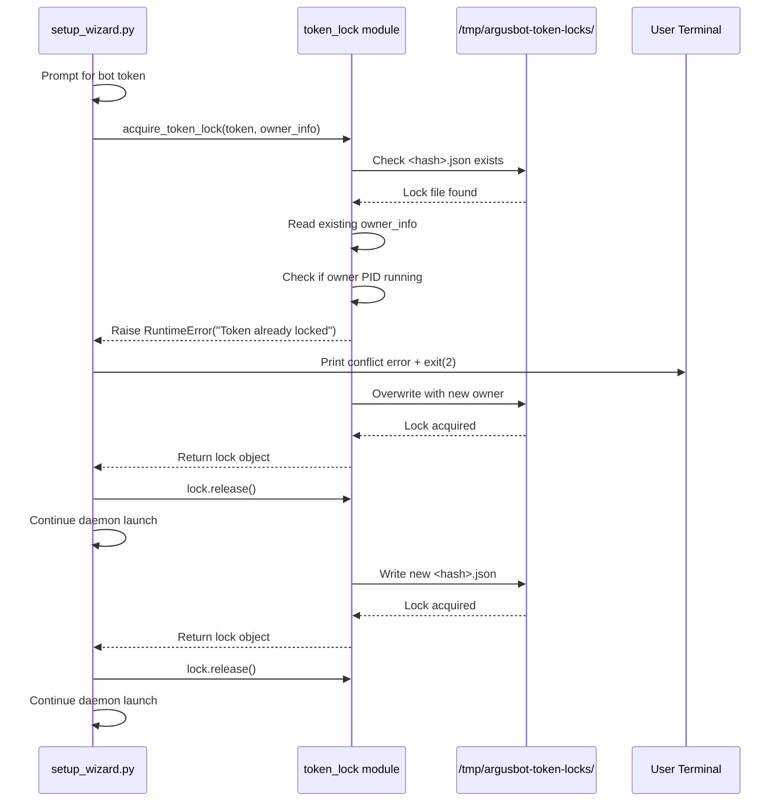
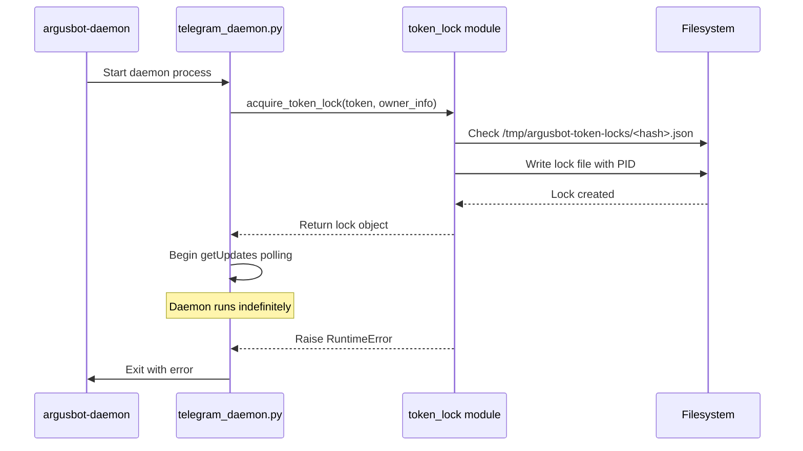
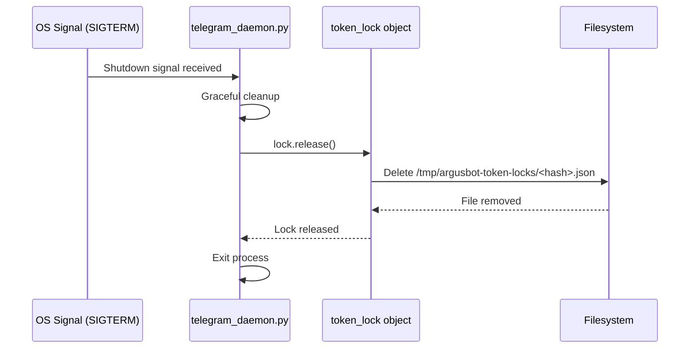

# Token Locking and Multi-Instance Safety
Relevant source files
- [README.md](https://github.com/waltstephen/ArgusBot/blob/6d0ec9f8/README.md?plain=1)
- [codex_autoloop/setup_wizard.py](https://github.com/waltstephen/ArgusBot/blob/6d0ec9f8/codex_autoloop/setup_wizard.py)
- [tests/test_setup_wizard.py](https://github.com/waltstephen/ArgusBot/blob/6d0ec9f8/tests/test_setup_wizard.py)

## Purpose and Scope

This page documents ArgusBot's token locking mechanism, which enforces single-daemon-per-token operation to prevent Telegram API conflicts. When multiple processes attempt to poll the same Telegram bot token using the `getUpdates` API, Telegram returns HTTP 409 "Conflict" errors. The token lock system ensures only one daemon instance can actively poll a given bot token at any time.

For general daemon architecture and command handling, see [Daemon Mode Architecture](/waltstephen/ArgusBot/3.2-daemon-mode-architecture). For session management and state persistence, see [Session Management and Resumption](/waltstephen/ArgusBot/7.1-session-management-and-resumption).

---

## The getUpdates Conflict Problem

### Telegram API Limitation

Telegram's `getUpdates` long-polling endpoint enforces exclusive access per bot token. When a second process calls `getUpdates` while another process already has an active polling connection, Telegram terminates the first connection and returns:

```
{
  "ok": false,
  "error_code": 409,
  "description": "Conflict: terminated by other getUpdates request"
}
```

This behavior prevents multiple ArgusBot daemon instances, or external tools, from polling the same bot simultaneously.

### Impact on ArgusBot

Without coordination, the following scenarios cause conflicts:

| Scenario | Problem |
| --- | --- |
| Multiple daemons in different workspaces | Each daemon attempts independent polling, causing mutual eviction |
| Daemon restart during setup | New daemon instance conflicts with existing daemon still polling |
| External monitoring tools | Third-party tools polling the same bot token disrupt daemon operation |
| Child process direct polling | If child CLI runs polled directly, they would conflict with parent daemon |

**Sources:**[README.md484-485](https://github.com/waltstephen/ArgusBot/blob/6d0ec9f8/README.md?plain=1#L484-L485)[setup_wizard.py509-518](https://github.com/waltstephen/ArgusBot/blob/6d0ec9f8/setup_wizard.py#L509-L518)

---

## Token Lock Architecture

### Lock-Based Exclusion

ArgusBot implements a file-based locking system that enforces mutual exclusion:

[Flowchart Diagram]

**Token Hash Function:**

The lock system uses a deterministic hash of the bot token to create unique lock filenames without storing the raw token:

[setup_wizard.py587-589](https://github.com/waltstephen/ArgusBot/blob/6d0ec9f8/setup_wizard.py#L587-L589)

```
def _token_hash(token: str) -> str:
    return hashlib.sha256(token.encode("utf-8")).hexdigest()[:24]
```

**Sources:**[setup_wizard.py143-152](https://github.com/waltstephen/ArgusBot/blob/6d0ec9f8/setup_wizard.py#L143-L152)[setup_wizard.py587-589](https://github.com/waltstephen/ArgusBot/blob/6d0ec9f8/setup_wizard.py#L587-L589)

---

## Lock Acquisition Flow

### Setup-Time Lock Validation

During `argusbot-setup` or `argusbot init`, the wizard performs a probe lock acquisition to verify exclusivity before starting the daemon:



**Probe Pattern:**

The setup wizard acquires the lock temporarily, validates exclusivity, then releases it before launching the daemon. The daemon itself re-acquires the lock for its lifetime:

[setup_wizard.py143-152](https://github.com/waltstephen/ArgusBot/blob/6d0ec9f8/setup_wizard.py#L143-L152)

```
try:
    probe_lock = acquire_token_lock(
        token=token,
        owner_info={"pid": "setup-probe", "run_cd": str(Path(args.run_cd).resolve())},
        lock_dir=args.token_lock_dir,
    )
except RuntimeError as exc:
    print(str(exc), file=sys.stderr)
    raise SystemExit(2)
else:
    probe_lock.release()
```

**Sources:**[setup_wizard.py143-152](https://github.com/waltstephen/ArgusBot/blob/6d0ec9f8/setup_wizard.py#L143-L152)[setup_wizard.py610-647](https://github.com/waltstephen/ArgusBot/blob/6d0ec9f8/setup_wizard.py#L610-L647)

---

## Lock Directory and File Structure

### Default Lock Location

Locks are stored in a global directory shared across all ArgusBot instances on the same machine:

| Setting | Default Value | Configurable Via |
| --- | --- | --- |
| Lock directory | `/tmp/argusbot-token-locks` | `--token-lock-dir` |
| Lock filename | `<token_hash>.json` | (automatic) |
| Lock permissions | `0o600` (owner read/write only) | (automatic) |

[setup_wizard.py1001-1004](https://github.com/waltstephen/ArgusBot/blob/6d0ec9f8/setup_wizard.py#L1001-L1004)

### Lock File Contents

Each lock file contains JSON metadata identifying the owning process:

```
{
  "pid": "12345",
  "run_cd": "/home/user/myproject",
  "chat_id": "8533505134",
  "timestamp": 1704067200
}
```

| Field | Description | Usage |
| --- | --- | --- |
| `pid` | Process ID of daemon | Liveness check |
| `run_cd` | Working directory of daemon | Conflict diagnosis |
| `chat_id` | Resolved Telegram chat ID | Reuse during setup |
| `timestamp` | Lock acquisition time | Audit trail |

**Sources:**[setup_wizard.py145-147](https://github.com/waltstephen/ArgusBot/blob/6d0ec9f8/setup_wizard.py#L145-L147)[setup_wizard.py521-537](https://github.com/waltstephen/ArgusBot/blob/6d0ec9f8/setup_wizard.py#L521-L537)

---

## Conflict Detection and Resolution

### getUpdates 409 Error Detection

When setup wizard attempts to resolve `chat_id=auto`, it polls `getUpdates` to discover the chat ID from recent messages. If another daemon is already polling, a 409 conflict occurs:

[Flowchart Diagram]

**Conflict Detection Logic:**

[setup_wizard.py591-593](https://github.com/waltstephen/ArgusBot/blob/6d0ec9f8/setup_wizard.py#L591-L593)

```
def _is_getupdates_conflict_error(message: str) -> bool:
    lowered = message.lower()
    return "getupdates http 409" in lowered or "other getupdates request" in lowered
```

**Fallback Resolution:**

When a conflict is detected, setup wizard attempts to reuse the `chat_id` from previous successful configurations:

[setup_wizard.py498-508](https://github.com/waltstephen/ArgusBot/blob/6d0ec9f8/setup_wizard.py#L498-L508)

```
fallback_chat_id, fallback_source = resolve_local_chat_id_hint(
    bot_token=bot_token,
    home_dir=home_dir,
    token_lock_dir=token_lock_dir,
)
if fallback_chat_id:
    print(
        f"Reusing existing Telegram chat_id={fallback_chat_id} from {fallback_source}.",
        file=sys.stderr,
    )
    return fallback_chat_id
```

**Sources:**[setup_wizard.py473-518](https://github.com/waltstephen/ArgusBot/blob/6d0ec9f8/setup_wizard.py#L473-L518)[setup_wizard.py591-593](https://github.com/waltstephen/ArgusBot/blob/6d0ec9f8/setup_wizard.py#L591-L593)

---

## Child Process Coordination

### Daemon-Only Polling Architecture

To avoid conflicts between parent daemon and child CLI processes, only the daemon polls Telegram directly. Child processes receive commands via the daemon bus:

[Flowchart Diagram]

**Key Architectural Decision:**

Child processes spawned by the daemon **never** poll Telegram directly. Instead:

- Daemon receives all Telegram commands via `getUpdates`
- Daemon writes commands to child's control bus file
- Child monitors its control bus for `/inject`, `/stop`, etc.

This ensures only one process (the daemon) holds the token lock and polls Telegram, completely avoiding 409 conflicts.

**Sources:**[README.md484-485](https://github.com/waltstephen/ArgusBot/blob/6d0ec9f8/README.md?plain=1#L484-L485)

---

## Implementation Details

### Token Lock Configuration

The lock directory is configurable via multiple mechanisms:

| Configuration Method | Priority | Example |
| --- | --- | --- |
| `--token-lock-dir` CLI argument | Highest | `--token-lock-dir /custom/path` |
| Default constant | Fallback | `/tmp/argusbot-token-locks` |

[setup_wizard.py1001-1004](https://github.com/waltstephen/ArgusBot/blob/6d0ec9f8/setup_wizard.py#L1001-L1004)

### Candidate Lock Directory Resolution

When searching for existing chat IDs across multiple potential lock locations, the wizard scans candidate directories:

[setup_wizard.py562-584](https://github.com/waltstephen/ArgusBot/blob/6d0ec9f8/setup_wizard.py#L562-L584)

```
def _candidate_token_lock_dirs(primary: str | Path | None) -> list[Path]:
    raw_candidates: list[Path] = []
    if primary:
        raw_candidates.append(Path(primary))
    try:
        raw_candidates.append(Path(default_token_lock_dir()))
    except Exception:
        pass
    raw_candidates.append(Path("/tmp/argusbot-token-locks"))
 
    # Deduplicate by resolved path
    candidates: list[Path] = []
    seen: set[str] = set()
    for candidate in raw_candidates:
        try:
            resolved = candidate.resolve()
        except Exception:
            resolved = candidate
        key = str(resolved).lower()
        if key in seen:
            continue
        seen.add(key)
        candidates.append(resolved)
    return candidates
```

**Sources:**[setup_wizard.py562-584](https://github.com/waltstephen/ArgusBot/blob/6d0ec9f8/setup_wizard.py#L562-L584)

---

## Lock Lifecycle

### Daemon Startup Sequence



### Daemon Shutdown Sequence



**Sources:**[setup_wizard.py143-152](https://github.com/waltstephen/ArgusBot/blob/6d0ec9f8/setup_wizard.py#L143-L152)[setup_wizard.py610-647](https://github.com/waltstephen/ArgusBot/blob/6d0ec9f8/setup_wizard.py#L610-L647)

---

## Restart and Cleanup

### Existing Daemon Shutdown

When `argusbot-setup` or `argusbot init` runs with `--restart-existing` (default: enabled), it automatically stops any existing daemon under the same `home-dir` before starting a new one:

[setup_wizard.py610-647](https://github.com/waltstephen/ArgusBot/blob/6d0ec9f8/setup_wizard.py#L610-L647)

**Stop Sequence:**

1. Read `daemon.pid` file for existing daemon PID
2. Send `daemon-stop` command via daemon bus
3. Wait 1 second for graceful shutdown
4. If still running, send `SIGTERM` to PID
5. Wait 1 second
6. If still running, send `SIGKILL` to PID
7. Remove stale `daemon.pid` file
8. Proceed with new daemon launch

This ensures clean token lock release even if the previous daemon didn't exit cleanly.

**Sources:**[setup_wizard.py68-69](https://github.com/waltstephen/ArgusBot/blob/6d0ec9f8/setup_wizard.py#L68-L69)[setup_wizard.py610-647](https://github.com/waltstephen/ArgusBot/blob/6d0ec9f8/setup_wizard.py#L610-L647)

---

## Multi-Instance Safety Summary

The token lock system provides comprehensive protection against conflicts:

| Protection Layer | Mechanism | Enforcement Point |
| --- | --- | --- |
| **Setup validation** | Probe lock acquisition | [setup_wizard.py143-152](https://github.com/waltstephen/ArgusBot/blob/6d0ec9f8/setup_wizard.py#L143-L152) |
| **Daemon exclusivity** | Token hash-based file lock | [token_lock module](https://github.com/waltstephen/ArgusBot/blob/6d0ec9f8/token_lock module) |
| **Stale lock cleanup** | PID liveness check | [lock acquisition logic](https://github.com/waltstephen/ArgusBot/blob/6d0ec9f8/lock acquisition logic) |
| **Child process isolation** | Bus-based command forwarding | [daemon architecture](https://github.com/waltstephen/ArgusBot/blob/6d0ec9f8/daemon architecture) |
| **Restart coordination** | Existing daemon shutdown | [setup_wizard.py610-647](https://github.com/waltstephen/ArgusBot/blob/6d0ec9f8/setup_wizard.py#L610-L647) |
| **Conflict detection** | 409 error pattern matching | [setup_wizard.py591-593](https://github.com/waltstephen/ArgusBot/blob/6d0ec9f8/setup_wizard.py#L591-L593) |
| **Chat ID reuse** | Fallback to existing config | [setup_wizard.py521-537](https://github.com/waltstephen/ArgusBot/blob/6d0ec9f8/setup_wizard.py#L521-L537) |

This multi-layered approach ensures reliable single-daemon-per-token operation across workspace changes, daemon restarts, and error recovery scenarios.

**Sources:**[README.md80](https://github.com/waltstephen/ArgusBot/blob/6d0ec9f8/README.md?plain=1#L80-L80)[README.md484-485](https://github.com/waltstephen/ArgusBot/blob/6d0ec9f8/README.md?plain=1#L484-L485)[setup_wizard.py143-152](https://github.com/waltstephen/ArgusBot/blob/6d0ec9f8/setup_wizard.py#L143-L152)[setup_wizard.py473-518](https://github.com/waltstephen/ArgusBot/blob/6d0ec9f8/setup_wizard.py#L473-L518)[setup_wizard.py610-647](https://github.com/waltstephen/ArgusBot/blob/6d0ec9f8/setup_wizard.py#L610-L647)