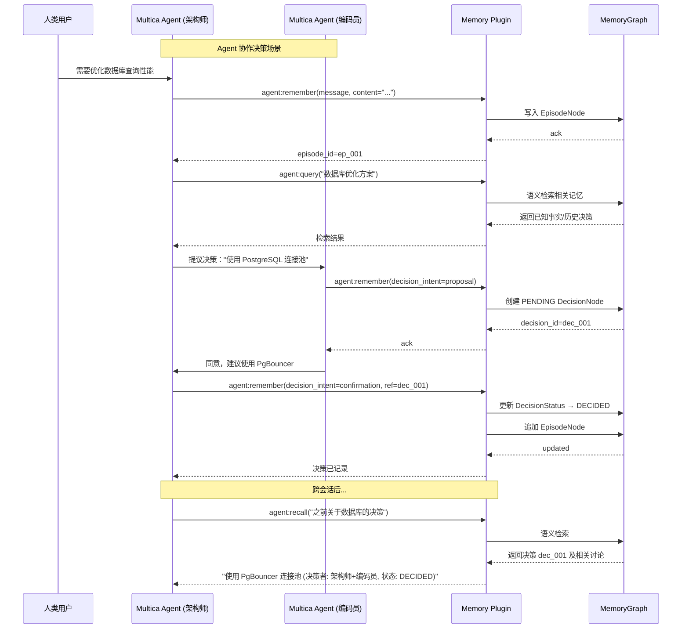

# Agent 协作对话流 + Multica 记忆插件设计方案

> 生成日期：2026-07-29  
> 作者：synthesis_agent  
> 关联文档：[决策时间线优化方案](decision_timeline_optimization.md)、[开源 AI Agent 协作场景调研报告](scenario_research_report.md)  
> 目标：将 Feishu-LongTerm-Mem 的飞书 IM 决策提取管道拓展为通用 Agent 协作记忆层，并封装为 Multica 平台的可插拔记忆插件

---

## 目录

1. [设计背景与目标](#1-设计背景与目标)
2. [Agent 协作对话流设计](#2-agent-协作对话流设计)
3. [Multica 记忆插件化设计](#3-multica-记忆插件化设计)
4. [架构融合图](#4-架构融合图)
5. [现有能力复用分析](#5-现有能力复用分析)
6. [风险与边界条件](#6-风险与边界条件)
7. [实施路线图](#7-实施路线图)

---

## 1. 设计背景与目标

### 1.1 当前定位

Feishu-LongTerm-Mem 当前是一个**飞书 IM → Hypergraph 记忆系统**的决策提取管道：

```
飞书 IM 消息 → 消息接收/拉取 → 话题检测(Detect) → Episode 提取 → Fact/Decision 提取 → MemoryGraph + Git 持久化 → MCP Server 检索
```

其核心能力包括：
- **三层 Hypergraph 结构**：Fact(L1) → Episode(L2) → Topic(L3)，附加 Decision(L0) 层
- **Git 版本化存储**：每个决策对应一个 Git 分支，支持版本历史和冲突管理
- **MCP 服务**：通过 stdio 暴露 38 个工具，支持 CRUD、树形遍历、关系网络、热度排名等
- **IM 适配器**：LarkIMClient 封装了飞书消息的接收/发送/拉取

### 1.2 设计目标

将上述能力从**单一飞书 IM 管道**拓展为**通用 Agent 协作记忆层**：

1. **输入多源化**：不仅接收飞书 IM，还要接收 A2A（Agent-to-Agent）通信、MCP Tool Call 日志、多 Agent 框架的对话流
2. **身份感知**：识别说话者是「人类/Agent/框架」，以及 Agent 的角色、所属团队
3. **上下文连贯**：跨会话、跨 Agent、跨框架追踪协作上下文
4. **插件化封装**：将记忆系统封装为 Multica 平台的可插拔 Memory Plugin
5. **端到端链路**：飞书 IM ↔ Agent 对话流 ↔ MemoryGraph ↔ Multica 插件 ↔ MCP Server 检索

---

## 2. Agent 协作对话流设计

### 2.1 对话流标准化输入格式

设计一个**通用消息信封**（Universal Message Envelope），统一封装来自不同来源的消息。

```python
@dataclass
class AgentMessageEnvelope:
    """Agent 协作对话流标准消息信封"""
    # === 消息标识 ===
    message_id: str                    # 全局唯一消息 ID
    conversation_id: str               # 对话/会话 ID（跨消息聚合）
    parent_message_id: Optional[str]   # 父消息 ID（用于线程回复）
    timestamp: datetime                # 消息发生时间

    # === 发送者身份 ===
    sender_id: str                     # 发送者 ID
    sender_type: SenderType            # HUMAN / AGENT / FRAMEWORK / SYSTEM
    sender_name: str                   # 显示名称
    sender_role: str                   # 角色标识（如 "architect"、"coder"、"researcher"）
    sender_team: Optional[str]         # 所属团队/组织

    # === 消息内容 ===
    content: str                       # 文本内容
    content_type: ContentType          # TEXT / MARKDOWN / JSON / CODE / CARD
    metadata: Dict[str, Any]           # 扩展元数据

    # === 源信息 ===
    source_channel: SourceChannel      # LARK_IM / A2A_MESSAGE / MCP_TOOL / FRAMEWORK_ORCHESTRATOR
    source_framework: Optional[str]    # 框架标识（如 "crewai"、"ag2"、"langgraph"、"multica"）
    framework_session_id: Optional[str] # 框架侧会话 ID

    # === 决策相关 ===
    decision_intent: Optional[DecisionIntent]  # 消息是否包含决策意图
    proposed_decision: Optional[str]           # 提议的决策内容（如适用）

    # === 认证与权限 ===
    auth_token_hash: Optional[str]     # 认证令牌哈希
    permission_level: PermissionLevel   # READ / WRITE / ADMIN
```

```python
class SenderType(Enum):
    HUMAN = "human"
    AGENT = "agent"
    FRAMEWORK = "framework"
    SYSTEM = "system"

class ContentType(Enum):
    TEXT = "text"
    MARKDOWN = "markdown"
    JSON = "json"
    CODE = "code"
    CARD = "card"

class SourceChannel(Enum):
    LARK_IM = "lark_im"
    A2A_MESSAGE = "a2a_message"
    MCP_TOOL = "mcp_tool"
    FRAMEWORK_ORCHESTRATOR = "framework_orchestrator"
    API = "api"
    WEBHOOK = "webhook"

class DecisionIntent(Enum):
    PROPOSAL = "proposal"          # 提议一个决策
    DISCUSSION = "discussion"      # 讨论中
    CONFIRMATION = "confirmation"  # 确认决策
    OBJECTION = "objection"        # 提出异议
    EXECUTION = "execution"        # 执行报告
    QUERY = "query"                # 询问现有决策
    STATUS_UPDATE = "status_update" # 状态更新
    NOT_DECISION = "not_decision"   # 非决策消息

class PermissionLevel(Enum):
    READ = "read"
    WRITE = "write"
    ADMIN = "admin"
```

### 2.2 Agent 身份识别与注册系统

```python
@dataclass
class AgentIdentity:
    """Agent 身份注册记录"""
    agent_id: str                    # 全局唯一 Agent ID
    display_name: str                # 显示名称
    agent_type: AgentType            # SINGLE / SQUAD / AUTOPILOT
    framework: str                   # 所属框架
    capabilities: List[str]          # 能力标签列表

    # === 隶属关系 ===
    team_id: Optional[str]           # 所属团队
    squad_id: Optional[str]          # 所属 Squad（Multica）

    # === 认证 ===
    api_key_hash: Optional[str]      # API 密钥哈希
    public_key: Optional[str]        # 公钥（用于签名验证）

    # === 注册信息 ===
    registered_at: datetime          # 注册时间
    last_heartbeat: datetime         # 最后心跳
    is_active: bool                  # 是否活跃

    # === 统计 ===
    total_messages: int = 0          # 发送总消息数
    total_decisions: int = 0         # 参与决策数
    reliability_score: float = 1.0   # 可靠性评分 (0-1)
```

**身份注册流程**：

```
Agent 启动 → 调用 Memory Plugin 的 register_agent() API → 返回 agent_id + API Key
         ↓（首次注册）
    创建 AgentIdentity 记录 → 持久化到 Agent Registry
         ↓
    可选: 绑定到 Squad/Team → 建立隶属关系
```

**消息鉴权流程**：

```
收到消息 → 提取 sender_id + auth_token
    → 查询 Agent Registry
    → 验证 token/签名
    → 记录消息
    → 更新 last_heartbeat + total_messages
```

### 2.3 协作上下文传递机制

设计**三层次上下文传递模型**，分别对应不同的作用域：

```python
@dataclass
class CollaborationContext:
    """协作上下文"""

    # === Level 1: 会话上下文（单个对话线程） ===
    conversation_id: str
    conversation_history: List[AgentMessageEnvelope]  # 最近 N 条
    active_topic: Optional[str]          # 当前话题

    # === Level 2: 工作流上下文（跨会话的协作工作） ===
    workflow_id: Optional[str]           # 工作流 ID
    workflow_stage: str                  # 当前阶段
    shared_decisions: List[DecisionNode] # 本工作流中已作出的决策
    pending_decisions: List[str]         # 待确认的决策 SDRID

    # === Level 3: 持久记忆上下文（跨工作流的长期知识） ===
    memory_graph_snapshot: Dict          # MemoryGraph 快照
    relevant_topics: List[TopicNode]     # 相关话题
    relevant_decisions: List[DecisionNode] # 相关决策
    agent_profiles: Dict[str, AgentIdentity]  # 参与 Agent 身份
```

**上下文传递策略**：

| 层级 | 触发条件 | 传递方式 | 数据量 |
|------|---------|---------|--------|
| L1: 会话 | 每轮对话 | 消息信封中的 `parent_message_id` 链 | KB 级 |
| L2: 工作流 | 工作流启动/阶段变更 | 通过 MCP Server 的 `set_workflow_context` | MB 级 |
| L3: 持久记忆 | Agent 启动/查询时 | 通过 MemoryGraph 检索 + MCP 查询 | GB 级（索引后 KB 级查询） |

**对话流 → MemoryGraph 的映射规则**：

```
AgentMessageEnvelope → EpisodeNode
├── message_id → EpisodeNode.id (前缀 "a2a_" + hash)
├── conversation_id → EpisodeNode.episode_description 中记录
├── sender_id → EpisodeNode.participants
├── content + metadata → EpisodeNode.original_data
├── timestamp → EpisodeNode.timestamp
├── decision_intent → 触发 DecisionNode 创建/更新
└── source_channel → EpisodeNode.type (扩展 RawDataType)

跨框架对话聚合:
├── same conversation_id → EpisodeHyperedge 中的同一话题
├── same decision_intent → 同一 DecisionHyperedge
└── parent_message_id → 版本链中的先后关系
```

### 2.4 多源消息接入适配器

```
┌─────────────────────────────────────────────────────┐
│                  Source Adapters                     │
│                                                      │
│  Lark IM Adapter ──→ LarkIMClient ──→ MessageEnvelope│
│  (已有)                                               │
│                                                      │
│  A2A Adapter ──→ WebSocket/HTTP ──→ MessageEnvelope  │
│  (新增)       CrewAI ↔ AG2 ↔ Multica Agent           │
│                                                      │
│  MCP Tool Log ──→ MCP Server Hook ──→ MessageEnvelope│
│  (新增)       tool call 历史自动记录                   │
│                                                      │
│  Framework Bridge ──→ Plugin API ──→ MessageEnvelope │
│  (新增)       LangGraph/CrewAI SDK 集成               │
│                                                      │
│  Webhook ──→ HTTP Endpoint ──→ MessageEnvelope        │
│  (新增)       GitHub Actions / CI / 外部系统           │
└─────────────────────────────────────────────────────┘
                         ↓
              AgentMessageRouter
              ├── 鉴权验证
              ├── 去重检测
              ├── 路由到目标 Agent（可选）
              └── 写入 MemoryGraph
```

### 2.5 与现有检测/提取管道的集成

现有管道（`src/detect/` → `src/extractors/` → `src/core/`）的处理流程适用于飞书 IM 的**批量后处理**，而 Agent 协作需要**流式实时处理**。设计两种模式：

| 模式 | 管道 | 适用场景 | 延迟 |
|------|------|---------|------|
| **Batched**（现有） | Detect → Episode Extract → Decision Extract | 飞书 IM 拉取后批量处理 | 分钟级 |
| **Streaming**（新增） | AgentMessageEnvelope → 实时 Decision Extract | Agent 实时对话 | 秒级 |

**Streaming 模式的数据流**：

```
AgentMessageEnvelope → StreamingDecisionExtractor
     ↓
     判断 decision_intent:
         PROPOSAL → 创建 PENDING DecisionNode
         CONFIRMATION → 更新 DecisionStatus → DECIDED
         OBJECTION → 追加 Objection
         EXECUTION → 更新 DecisionStatus → EXECUTING
         QUERY → 返回 MemoryGraph 检索结果
     ↓
     更新 MemoryGraph + Git 快照
     ↓
     触发 notification（如有需要）
```

---

## 3. Multica 记忆插件化设计

### 3.1 插件架构概览

```
┌────────────────────────────────────────────────────┐
│                    Multica Workspace                │
│  ┌──────────────────────────────────────────────┐  │
│  │          Feishu-Mem Plugin (Memory Plugin)     │  │
│  │                                               │  │
│  │  ┌──────────┐  ┌──────────┐  ┌───────────┐   │  │
│  │  │   Agent  │  │   MCP    │  │ Memory    │   │  │
│  │  │  Skill   │  │  Server  │  │ Graph     │   │  │
│  │  │ (读写)    │  │ (38tools)│  │ Core      │   │  │
│  │  └──────────┘  └──────────┘  └───────────┘   │  │
│  │         ↓            ↑            ↑           │  │
│  │  ┌──────────┐  ┌──────────┐  ┌───────────┐   │  │
│  │  │Agent     │  │API       │  │ Git       │   │  │
│  │  │Registry  │  │Gateway   │  │ Storage   │   │  │
│  │  └──────────┘  └──────────┘  └───────────┘   │  │
│  └──────────────────────────────────────────────┘  │
│                                                    │
│  ┌──────────────────────────────────────────────┐  │
│  │         Multica Agent Runtime                  │  │
│  │  [synthesis] [architect] [researcher] [coder]  │  │
│  │    ↑ 通过 Skill 调用记忆插件   ↑               │  │
│  └──────────────────────────────────────────────┘  │
└────────────────────────────────────────────────────┘
```

### 3.2 插件边界与服务接口

#### 3.2.1 Multica Skill 接口（面向 Agent）

将记忆系统的核心操作封装为 Multica Skill，Agent 通过 `//command` 或自然语言调用。

```yaml
# plugin.json (提案)
{
  "name": "Feishu-Mem Memory Plugin",
  "version": "1.0.0",
  "description": "持久化记忆层：为 Multica Agent 提供协作记忆读写、决策追踪、上下文检索能力",
  "skills": [
    {
      "name": "mem:remember",
      "description": "记录一段协作对话到长期记忆。Agent 之间、Agent 与人类之间的对话自动持久化",
      "arguments": {
        "conversation_id": "会话 ID（自动生成或指定）",
        "message": "消息内容",
        "sender_info": "发送者身份信息（自动获取）"
      }
    },
    {
      "name": "mem:recall",
      "description": "基于语义查询检索相关记忆，支持 topic/决策/事实多维度",
      "arguments": {
        "query": "检索查询",
        "topic": "可选：限定话题范围",
        "top_k": 10
      }
    },
    {
      "name": "mem:decisions",
      "description": "查询当前活跃的决策列表，按时间/热度/状态过滤",
      "arguments": {
        "status": "可选：按状态过滤",
        "topic": "可选：按话题过滤",
        "top_k": 20
      }
    },
    {
      "name": "mem:agents",
      "description": "查询已注册的协作 Agent 列表",
      "arguments": {}
    },
    {
      "name": "mem:track",
      "description": "为一个工作流（workflow）启用记忆追踪",
      "arguments": {
        "workflow_id": "工作流 ID",
        "participants": "参与 Agent ID 列表"
      }
    }
  ]
}
```

#### 3.2.2 REST API 接口（面向外部系统）

| 端点 | 方法 | 描述 | 认证 |
|------|------|------|------|
| `/api/v1/messages` | POST | 接收 Agent 消息并写入记忆 | API Key |
| `/api/v1/query` | POST | 语义检索记忆 | API Key |
| `/api/v1/decisions` | GET | 查询决策列表 | API Key |
| `/api/v1/decisions/{sid}` | GET | 决策详情 | API Key |
| `/api/v1/agents/register` | POST | Agent 注册 | 首次免认证 |
| `/api/v1/agents/{id}` | GET | 查询 Agent 状态 | API Key |
| `/api/v1/conversations/{id}` | GET | 查询对话历史 | API Key |
| `/api/v1/health` | GET | 健康检查 | 无 |

#### 3.2.3 MCP Server 工具增强

现有 38 个 MCP 工具中，需增强以下工具以支持 Agent 协作场景：

| 工具名 | 当前功能 | Agent 协作增强 |
|--------|---------|---------------|
| `create_decision` | 创建决策 | 增加 `source_channel` 参数（支持 a2a/framework） |
| `search` | 搜索决策 | 增加 `sender_type` 过滤器（human vs agent） |
| `decision_history` | 版本历史 | 增加 Agent 协作来源标注 |
| `recent_decisions` | 最近决策 | 增加按 source_channel 分组统计 |

新增 MCP 工具：

| 工具名 | 描述 |
|--------|------|
| `list_agents` | 列出已注册的协作 Agent |
| `get_agent` | 查询 Agent 详细信息和统计 |
| `get_conversation` | 获取完整对话流（跨框架聚合） |
| `set_workflow_context` | 设置当前工作流上下文 |

### 3.3 权限模型

```
┌─────────────────────────────────────────────────────────────┐
│                    Permission Hierarchy                       │
│                                                              │
│  Workspace Admin ──→ 完全控制：CRUD + Agent 管理 + 权限分配    │
│       ↓                                                      │
│  Project Admin  ──→ 项目级：读写记忆 + Agent 注册 + 查询       │
│       ↓                                                      │
│  Team Lead      ──→ 团队级：读写团队记忆 + 团队成员状态查询     │
│       ↓                                                      │
│  Agent          ──→ 自己级：写入自己的消息 + 查询公开记忆       │
│       ↓                                                      │
│  Read-Only Agent ──→ 只读：查询已有记忆                        │
└─────────────────────────────────────────────────────────────┘
```

**权限检查流程**：

```
收到请求 → 提取 auth_token → 查询 AgentRegistry
    → 获取 permission_level
    → 检查 action 是否在允许范围内
    → 通过则执行，否则返回 403
```

### 3.4 数据流与存储架构

```
          写入路径                          读取路径
    ┌─────────────────┐            ┌─────────────────┐
    │ AgentMessage     │            │ MCP Query /      │
    │ Envelope         │            │ API Gateway      │
    └────────┬────────┘            └────────┬────────┘
             ↓                               ↓
    ┌─────────────────┐            ┌─────────────────┐
    │ Message Router   │            │ Query Router     │
    │ (鉴权+去重)      │            │ (意图识别)       │
    └────────┬────────┘            └────────┬────────┘
             ↓                               ↓
    ┌─────────────────┐            ┌─────────────────┐
    │ Streaming        │            │ MemoryGraph     │
    │ Decision         │            │ Retrieval       │
    │ Extractor        │            │ (语义+关键词)    │
    └────────┬────────┘            └────────┬────────┘
             ↓                               ↓
    ┌─────────────────┐            ┌─────────────────┐
    │ MemoryGraph      │            │ Embedding +     │
    │ Upsert           │◄───────────│ Reranker        │
    └────────┬────────┘            └─────────────────┘
             ↓
    ┌─────────────────┐
    │ Git Storage      │
    │ (版本化持久化)    │
    └─────────────────┘
```

### 3.5 与现有项目的整合点

| 现有模块 | 文件 | 变更类型 | 说明 |
|---------|------|---------|------|
| `src/types.py` | `RawDataType` | 扩展 | 增加 `A2A_CONVERSATION`、`FRAMEWORK_MESSAGE` |
| `src/structure.py` | `EpisodeNode` | 扩展 | 增加 `source_channel`、`framework` 字段 |
| `src/node/node.py` | `DecisionNode` | 扩展 | `source_type` 已支持 im/doc/meeting/manual，增加 `a2a`、`framework` |
| `src/adapter/lark_im.py` | LarkIMClient | 保留 | 封装为 IM 适配器，不修改 |
| `src/extractors/decision_extractor.py` | DecisionExtractor | 扩展 | 增加 Streaming 模式 |
| `src/graph/memory_graph.py` | MemoryGraph | 扩展 | 增加 agent 查询接口 |
| `src/mcp_server/server.py` | MCP Server | 扩展 | 增加 Agent 相关工具 |
| `src/core/engine.py` | PipelineEngine | 扩展 | 支持 Agent 消息触发的 Mutation |
| `src/config.py` | — | 扩展 | 增加插件配置项 |

---

## 4. 架构融合图

### 4.1 端到端链路（Mermaid 图）

```mermaid
flowchart TB
    %% 样式定义
    classDef lark fill:#3370ff,color:#fff
    classDef agent fill:#00b368,color:#fff
    classDef memory fill:#ff8c00,color:#fff
    classDef plugin fill:#7c3aed,color:#fff
    classDef storage fill:#64748b,color:#fff

    %% 输入层：飞书 IM
    subgraph Input ["输入层 Sources"]
        L1[飞书 IM 群聊]:::lark
        L2[飞书 IM 私聊]:::lark
    end

    %% 输入层：Agent 协作
    subgraph AgentInput ["输入层 Agent Collaboration"]
        A1[CrewAI Crew]:::agent
        A2[AG2 Agent 对话]:::agent
        A3[LangGraph Workflow]:::agent
        A4[Multica Agent]:::agent
        A5[Multica Squad]:::agent
    end

    %% 输入层：其他来源
    subgraph OtherInput ["输入层 Other"]
        O1[Webhook / API]:::agent
        O2[MCP Tool Call 日志]:::agent
    end

    %% 适配器层
    subgraph Adapter ["适配层 Adapters"]
        direction TB
        Ad1[Lark IM Adapter\nsrc/adapter/lark_im.py]
        Ad2[A2A Adapter\n（新增）]
        Ad3[Framework Bridge\n（新增）]
        Ad4[Webhook Handler\n（新增）]
        Ad5[MCP Logger\n（新增）]
    end

    %% 标准化消息格式
    Msg[标准化消息信封\nAgentMessageEnvelope]

    %% 路由与处理
    subgraph Processing ["处理层 Processing"]
        direction TB
        P1[Agent 身份验证\nAgent Registry]
        P2[去重检测\nDedup Engine]
        P3[路由决策\nRouter]
        P4[流式决策提取\nStreaming Decision Extractor]
        P5[批量决策提取\nBatch Decision Extractor\nsrc/extractors/]
    end

    %% 核心记忆层
    subgraph Memory ["核心记忆层 Hypergraph"]
        direction TB
        M1[MemoryGraph\nsrc/graph/memory_graph.py]
        M2[三层 Hypergraph\nFact → Episode → Topic\n+ Decision(L0)]
        M3[Git 版本化存储\nGit Storage\nsrc/storage/]
    end

    %% Multica 插件封装
    subgraph MulticaPlugin ["Multica 插件封装 Plugin"]
        direction TB
        MP1[Memory Skill\nmem:remember/recall]
        MP2[Decision Skill\nmem:decisions/track]
        MP3[Agent Skill\nmem:agents]
    end

    %% 检索与输出
    subgraph Output ["检索输出层 Output"]
        direction TB
        O3[MCP Server\n38 tools\nsrc/mcp_server/server.py]
        O4[REST API\n（新增）]
        O5[Agent 上下文注入\nContext Injection]
    end

    %% 连接关系
    L1 --> Ad1
    L2 --> Ad1
    A1 --> Ad3
    A2 --> Ad3
    A3 --> Ad3
    A4 --> Ad2
    A5 --> Ad2
    O1 --> Ad4
    O2 --> Ad5

    Ad1 --> Msg
    Ad2 --> Msg
    Ad3 --> Msg
    Ad4 --> Msg
    Ad5 --> Msg

    Msg --> P1
    P1 --> P2
    P2 --> P3
    P3 --> P4
    P3 --> P5

    P4 --> M1
    P5 --> M1

    M1 <--> M2
    M2 <--> M3

    M1 --> MP1
    M1 --> MP2
    M1 --> MP3

    MP1 --> O3
    MP2 --> O3
    MP3 --> O3

    O3 --> O4
    O3 --> O5
    O4 --> O5
    O5 --> A4
    O5 --> A5

    %% 飞书推送反馈
    M3 -.->|推送通知| L1
```

### 4.2 数据流向说明

| 阶段 | 输入 | 处理 | 输出 | 延迟 |
|------|------|------|------|------|
| **① IM 摄入** | 飞书群聊消息 | Lark IM 拉取 → 批量检测 → 提取 | EpisodeNode + DecisionNode | 分钟级 |
| **② Agent 会话** | Agent 对话消息 | A2A Adapter 接收 → 流式提取 | EpisodeNode + DecisionNode | 秒级 |
| **③ 框架集成** | CrewAI/AG2 消息 | Framework Bridge 转换 | 标准化 MessageEnvelope | 实时 |
| **④ 记忆检索** | Agent 语义查询 | MCP Server/API → MemoryGraph | 相关记忆上下文 | 亚秒级 |
| **⑤ 插件接口** | Multica Agent Skill 调用 | Skill → API Gateway → MemoryGraph | Agent 可读的记忆上下文 | 秒级 |

### 4.3 Mermaid 序列图：Agent 协作决策流程示例



---

## 5. 现有能力复用分析

### 5.1 可直接复用的模块

| 模块 | 文件 | 复用方式 |
|------|------|---------|
| `MemoryGraph` | `src/graph/memory_graph.py` | 核心记忆索引，无需修改 |
| `DecisionNode` | `src/node/node.py` | 已有 `source_type` 字段，扩展 `a2a` 值 |
| `GitStorage` | `src/storage/git_storage.py` | 版本化持久化层，无需修改 |
| `Hypergraph` | `src/structure.py` | 数据结构定义，少量扩展 |
| `PipelineEngine` | `src/core/engine.py` | Mutation 处理引擎，无需修改 |
| `MCP Server` | `src/mcp_server/server.py` | 38 工具基础，增加 Agent 工具 |
| `LarkIMClient` | `src/adapter/lark_im.py` | 封装为 IM 适配器 |
| `EmbeddingProvider` | `src/model/embedding_provider.py` | 语义检索基础 |
| `RerankerProvider` | `src/model/reranker_provider.py` | 检索结果重排序 |

### 5.2 需要新增的模块

| 模块 | 估算规模 | 说明 |
|------|---------|------|
| `AgentMessageEnvelope` | ~50 行 | 标准化数据类 |
| `AgentRegistry` | ~150 行 | Agent 身份注册与验证 |
| `A2A Adapter` | ~200 行 | 接收 Multica Agent A2A 消息 |
| `Framework Bridge` | ~200 行 | CrewAI/AG2 框架适配 |
| `StreamingDecisionExtractor` | ~150 行 | 实时决策提取（复用现有 extractor 的 LLM 调用） |
| `REST API Gateway` | ~300 行 | FastAPI HTTP 端点 |
| `Multica Skill` | ~100 行 | 记忆读写 Skill 定义 |
| Webhook Handler | ~100 行 | 外部系统事件接入 |

### 5.3 需要扩展的模块

| 模块 | 变更 | 估算 |
|------|------|------|
| `src/types.py` | `RawDataType` 增加 `A2A_CONVERSATION` | +2 行 |
| `src/structure.py` | `EpisodeNode` 增加 `source_channel`、`framework` 字段 | +20 行 |
| `src/node/types.py` | `DecisionStatus` 增加 `AWAITING_VOTE` | +1 行 |
| `src/mcp_server/server.py` | 增加 Agent 相关 5 个工具 | +200 行 |

### 5.4 无需修改的模块

- `src/detect/` — 检测层，仍用于 IM 话题检测，Agent 场景用新方法
- `src/card/` — 推送卡片，仍用于飞书 IM 通知
- `src/llm/` — LLM 客户端，复用
- `src/prompts/` — 提示词，Agent 消息可用新提示词
- `src/storage/git_storage.py` — Git 存储层，无需修改

---

## 6. 风险与边界条件

### 6.1 风险识别

| 风险 | 等级 | 影响 | 缓解措施 |
|------|------|------|---------|
| Agent 身份伪造 | 高 | 未授权 Agent 可写入/篡改记忆 | API Key + 签名验证 + Heartbeat 检测 |
| 消息风暴 | 中 | Agent 高频对话导致写入压力 | 消息去重 + 批量写入 + 限流 |
| 跨框架上下文丢失 | 中 | 不同框架的会话 ID 体系不同 | 通用 `conversation_id` 映射表 |
| 感知递归 | 低 | Agent 将插件输出当作新消息再写入 | 避免回路：source_type 标记 + 去重 |
| 隐私泄露 | 高 | 未授权 Agent 读取敏感决策 | 按 Team/Project 隔离 + 权限检查 |
| 版本冲突 | 低 | 多 Agent 同时更新同一决策 | 现有 Git 分支机制 + 冲突检测 |

### 6.2 边界条件

| 条件 | 设计决策 |
|------|---------|
| Agent 数量上限 | 单实例支持 1000 个活跃 Agent Registry 条目 |
| 消息吞吐 | Streaming 模式 ~100 条/秒，Batched 模式取决于飞书 API 限速 |
| 消息大小上限 | 标准化信封 ≤ 1MB（content 字段限制） |
| 跨网络延迟 | A2A Adapter 基于 HTTP/WebSocket，预期延迟 < 100ms |
| 离线 Agent | Agent 长时间无心跳 → 标记 inactive → 存储但不再路由新消息 |

### 6.3 与现有系统的兼容性

- **向后兼容**：所有现有 MCP 工具保持原样，新增工具仅作为扩展
- **IM 管道不动**：飞书 IM → Episode/Decision 的批处理管道完全保留
- **数据结构不回溯**：现有 Hypergraph 中的 EpisodeNode 无需重写，新字段默认空值

---

## 7. 实施路线图

### 第一阶段：基础能力（核心数据结构和适配器）— 3-5 天

1. **定义 `AgentMessageEnvelope` 标准化数据类**（`src/types.py` 扩展）
2. **扩展 `EpisodeNode` 字段**（`src/structure.py`）
3. **扩展 `DecisionNode.source_type` 枚举值**（`src/node/node.py`）
4. **创建 `AgentRegistry` 模块**（新增 `src/adapter/agent_registry.py`）

### 第二阶段：A2A 适配与实时提取 — 5-7 天

1. **创建 A2A Adapter**（新增 `src/adapter/a2a_adapter.py`）
2. **创建 Framework Bridge 原型**（CrewAI 适配）
3. **创建 `StreamingDecisionExtractor`**（基于现有 extractor 改造）
4. **集成测试：Agent 对话 → MemoryGraph**

### 第三阶段：Multica 插件封装 — 3-5 天

1. **定义 Multica Skill（`mem:remember`, `mem:recall` 等）**
2. **创建 REST API Gateway**
3. **Multica Plugin 注册与认证流**
4. **集成测试：Multica Agent → Skill → MemoryGraph → 检索**

### 第四阶段：高级功能与优化 — 5-7 天

1. **跨框架上下文映射**
2. **Agent 协作工作流追踪（`mem:track`）**
3. **Agent 可靠性评分与统计**
4. **性能优化：缓存、批量、限流**
5. **安全性审计与权限模型完善**

---

## 附录 A：关键设计决策记录

| ADR | 决策 | 备选方案 | 理由 |
|-----|------|---------|------|
| ADR-001 | 标准化消息信封统一所有来源 | 每种来源独立格式 | 统一处理链，降低适配器复杂度 |
| ADR-002 | Streaming + Batched 双模式 | 只有 Streaming | 保留 IM 批处理的稳定路径 |
| ADR-003 | 基于 Multica Skill 封装 | 独立部署微服务 | 与 Multica 平台原生集成，减少运维 |
| ADR-004 | Agent 身份基于 Registry + API Key | OAuth2 / JWT | 轻量，适合 Agent 场景，后期可升级 |
| ADR-005 | 不修改现有 Hypergraph 回溯 | 重写所有 EpisodeNode | 向后兼容，零迁移成本 |

## 附录 B：AgentMessageEnvelope 序列化示例

```json
{
  "message_id": "msg_a2a_001",
  "conversation_id": "conv_workflow_42",
  "parent_message_id": "msg_a2a_000",
  "timestamp": "2026-07-29T10:30:00Z",
  "sender_id": "agent_arch_001",
  "sender_type": "agent",
  "sender_name": "Architect-001",
  "sender_role": "architect",
  "sender_team": "core-team",
  "content": "建议使用 PgBouncer 作为 PostgreSQL 连接池方案",
  "content_type": "text",
  "metadata": {
    "model": "claude-opus-4",
    "confidence": 0.92,
    "token_count": 45
  },
  "source_channel": "a2a_message",
  "source_framework": "multica",
  "framework_session_id": "sess_abc123",
  "decision_intent": "proposal",
  "proposed_decision": "采用 PgBouncer 作为数据库连接池",
  "permission_level": "write"
}
```